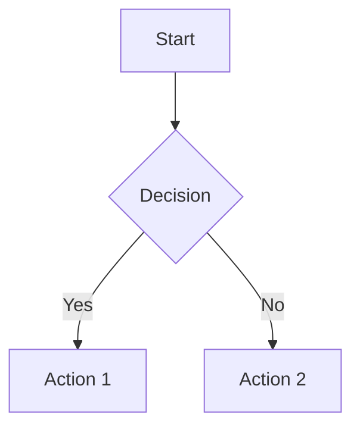
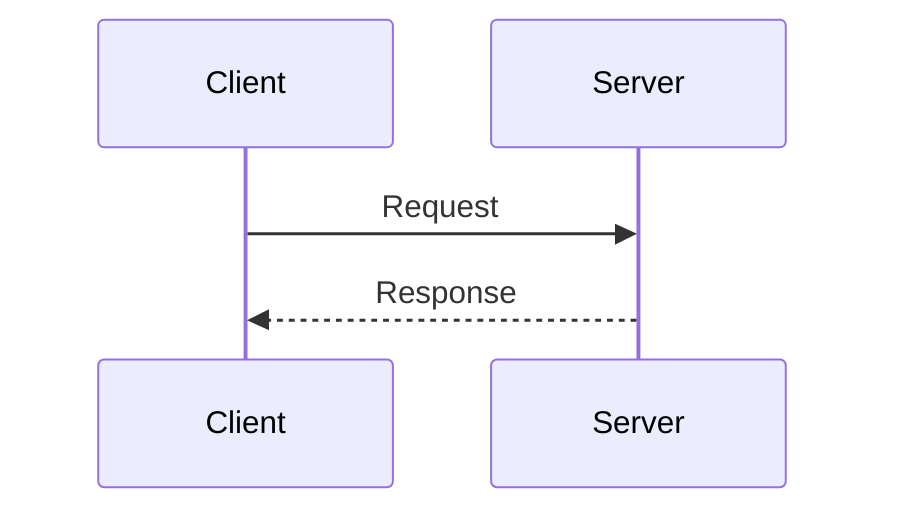
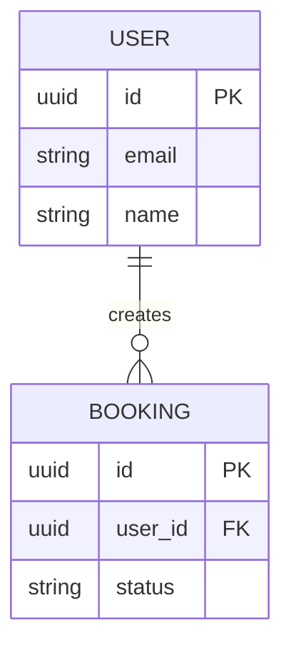
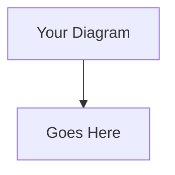

# TravelDen Documentation

This directory contains the complete documentation for the TravelDen travel booking platform, built with MkDocs and featuring Mermaid diagram support for GitHub Pages deployment.

## 🚀 Quick Start

### Using Docker (Recommended)

1. **Start the documentation server:**
   ```bash
   cd project-docs
   docker-compose up mkdocs
   ```

2. **Open your browser:**
   Navigate to `http://localhost:8000`

3. **Stop the server:**
   ```bash
   docker-compose down
   ```

### Local Development

1. **Install Python dependencies:**
   ```bash
   pip install -r requirements.txt
   ```

2. **Start the development server:**
   ```bash
   mkdocs serve
   ```

3. **Open your browser:**
   Navigate to `http://127.0.0.1:8000`

## 📁 Project Structure

```
project-docs/
├── docs/                          # Documentation source files
│   ├── index.md                   # Homepage
│   ├── architecture/              # Architecture documentation
│   │   ├── index.md              # Architecture overview
│   │   ├── system-design.md      # System design details
│   │   └── database-schema.md    # Database schemas
│   ├── services/                  # Service documentation
│   │   ├── booking-service.md    # Booking service docs
│   │   ├── payment-service.md    # Payment service docs
│   │   ├── product-service.md    # Product service docs
│   │   └── user-service.md       # User service docs
│   ├── api/                       # API documentation
│   │   ├── getting-started.md    # API getting started
│   │   ├── authentication.md     # Authentication guide
│   │   └── endpoints.md          # API endpoints
│   ├── deployment/                # Deployment guides
│   │   ├── docker.md             # Docker deployment
│   │   ├── cicd.md               # CI/CD pipeline
│   │   └── environment.md        # Environment config
│   └── contributing/              # Contributing guides
│       ├── development.md        # Development guide
│       ├── standards.md          # Code standards
│       └── testing.md            # Testing guide
├── .github/
│   └── workflows/
│       └── docs.yml              # GitHub Actions workflow
├── Dockerfile                    # Docker configuration
├── docker-compose.yml           # Docker Compose configuration
├── mkdocs.yml                   # MkDocs configuration
├── requirements.txt             # Python dependencies
└── README.md                    # This file
```

## 🐳 Docker Commands

### Development Server
```bash
# Start development server with live reload
docker-compose up mkdocs

# Start in background
docker-compose up -d mkdocs

# View logs
docker-compose logs -f mkdocs
```

### Build Documentation
```bash
# Build static site
docker-compose --profile build up mkdocs-build

# The built site will be in the ./site directory
```

### Deploy to GitHub Pages
```bash
# Deploy to GitHub Pages (requires GitHub authentication)
docker-compose --profile deploy up mkdocs-gh-deploy
```

## 🔧 Configuration

### MkDocs Configuration (`mkdocs.yml`)

Key features enabled:
- **Material Theme**: Modern, responsive design
- **Mermaid Diagrams**: Support for flowcharts, sequence diagrams, etc.
- **Search**: Full-text search functionality
- **Git Integration**: Automatic last-updated timestamps
- **Code Highlighting**: Syntax highlighting for code blocks
- **Navigation**: Automatic navigation generation

### Docker Configuration

- **Base Image**: Python 3.11 slim
- **Port**: 8000 (configurable)
- **Volume Mounting**: Live reload during development
- **Multi-stage**: Separate profiles for dev, build, and deploy

## 📊 Mermaid Diagrams

This documentation supports Mermaid diagrams for visual documentation:

### Flowcharts


### Sequence Diagrams


### Entity Relationship Diagrams


## 🚀 GitHub Pages Deployment

### Automatic Deployment

The documentation is automatically deployed to GitHub Pages when:
- Changes are pushed to the `gh-pages` branch
- Changes are made to files in the `project-docs/` directory

### Manual Deployment

1. **Enable GitHub Pages** in your repository settings
2. **Set source** to "GitHub Actions"
3. **Push changes** to the main branch
4. **Check deployment** in the Actions tab

### Custom Domain (Optional)

To use a custom domain:
1. Add a `CNAME` file to the `docs/` directory
2. Configure DNS settings
3. Enable HTTPS in GitHub Pages settings

## 🛠️ Development

### Adding New Pages

1. **Create markdown file** in the appropriate `docs/` subdirectory
2. **Update navigation** in `mkdocs.yml` if needed
3. **Test locally** with `mkdocs serve`
4. **Commit and push** changes

### Adding Mermaid Diagrams

```markdown

```

### Customizing Theme

Edit `mkdocs.yml` to customize:
- Colors and fonts
- Navigation structure
- Plugin configuration
- Additional features

## 📝 Writing Guidelines

### Markdown Best Practices

- Use descriptive headings
- Include code examples
- Add diagrams for complex concepts
- Link between related pages
- Keep content up-to-date

### Mermaid Diagram Guidelines

- Use consistent styling
- Keep diagrams simple and readable
- Include diagram descriptions
- Test diagrams in the live preview

## 🔍 Troubleshooting

### Common Issues

1. **Port 8000 already in use:**
   ```bash
   # Use different port
   docker-compose up mkdocs -p 8001:8000
   ```

2. **Permission issues with Docker:**
   ```bash
   # Fix file permissions
   sudo chown -R $USER:$USER .
   ```

3. **Mermaid diagrams not rendering:**
   - Check syntax in Mermaid Live Editor
   - Ensure proper code block formatting
   - Verify plugin configuration

4. **GitHub Pages deployment fails:**
   - Check GitHub Actions logs
   - Verify repository permissions
   - Ensure all dependencies are in requirements.txt

### Getting Help

- Check the [MkDocs documentation](https://www.mkdocs.org/)
- Review [Material theme docs](https://squidfunk.github.io/mkdocs-material/)
- Visit [Mermaid documentation](https://mermaid-js.github.io/mermaid/)
- Open an issue in the repository

## 📄 License

This documentation is part of the TravelDen project. See the main repository for license information.

## 🤝 Contributing

We welcome contributions to improve our documentation:

1. Fork the repository
2. Create a feature branch
3. Make your changes
4. Test locally
5. Submit a pull request

For detailed contributing guidelines, see [Contributing Guide](docs/contributing/development.md).

---

**Last Updated:** January 2024  
**MkDocs Version:** 1.5.3  
**Material Theme Version:** 9.4.8