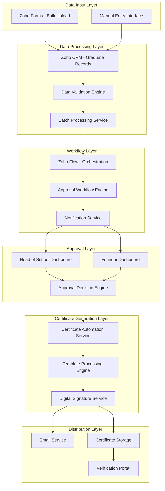
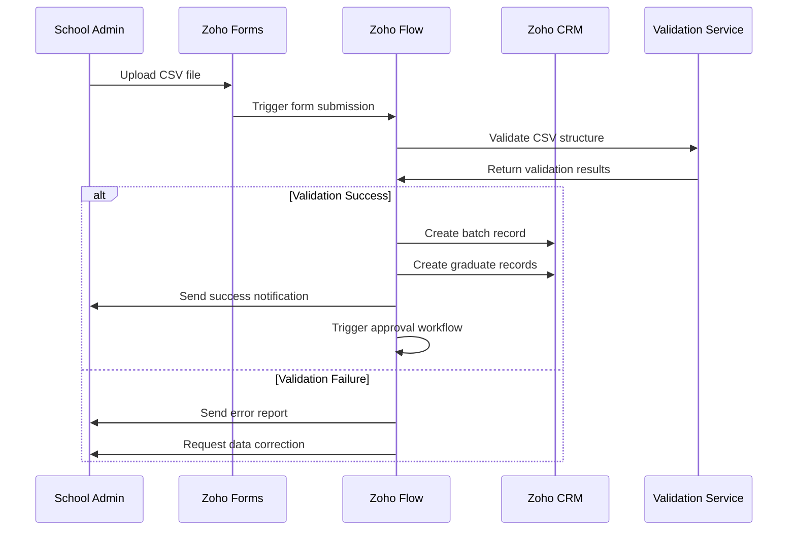
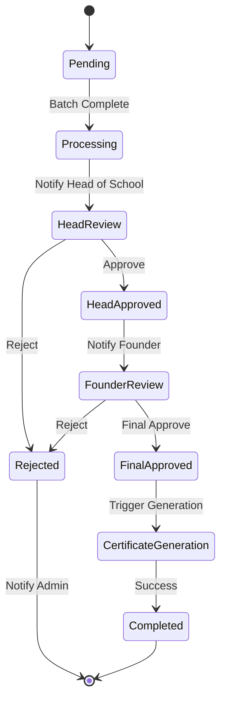
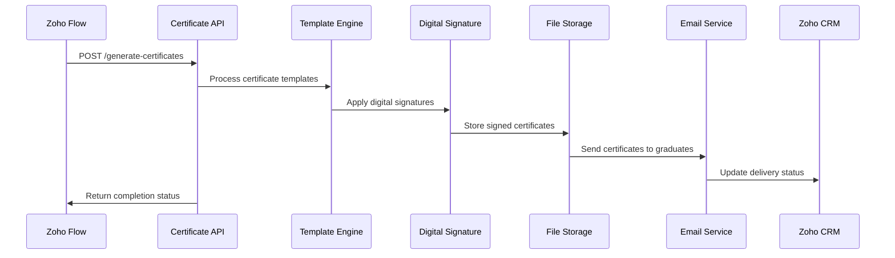

# Lagos Aviation Academy Certificate Automation System
## Technical Documentation v1.0

### Document Information
- **Version**: 1.0
- **Date**: July 31, 2025
- **Author**: Omotayo Isaiah Kuye
- **Status**: Draft
- **Classification**: Internal Technical Documentation

---

## Table of Contents

1. [System Overview](#1-system-overview)
2. [Architecture Design](#2-architecture-design)
3. [Component Specifications](#3-component-specifications)
4. [Data Models and Schemas](#4-data-models-and-schemas)
5. [API Specifications](#5-api-specifications)
6. [Workflow Implementations](#6-workflow-implementations)
7. [Security and Compliance](#7-security-and-compliance)
8. [Deployment Guide](#8-deployment-guide)
9. [Monitoring and Maintenance](#9-monitoring-and-maintenance)
10. [Troubleshooting Guide](#10-troubleshooting-guide)

---

## 1. System Overview

### 1.1 Purpose
The Certificate Automation System streamlines the generation, approval, and distribution of graduation certificates for Lagos Aviation Academy, reducing processing time by 95% while maintaining security and audit compliance.

### 1.2 Scope
- Automated certificate generation workflow
- Multi-stage approval process
- Digital signature integration
- Certificate verification portal
- Bulk graduate data processing
- Email distribution system

### 1.3 Technology Stack
- **Primary Platform**: Zoho Ecosystem (Flow, CRM, Forms, Creator, Sign)
- **Certificate Generation**: Custom Certificate Automation Service
- **Database**: Zoho CRM + Custom modules
- **Authentication**: Zoho OAuth 2.0
- **File Storage**: Zoho WorkDrive
- **Monitoring**: Zoho Analytics

### 1.4 Key Stakeholders
| Role | Responsibilities | System Access |
|------|-----------------|---------------|
| School Administrator | Data upload, template management | Full system access |
| Head of School | First-level approval | Approval dashboard |
| School Founder | Final approval, signature | Executive dashboard |
| IT Support | System maintenance | Administrative access |

---

## 2. Architecture Design

### 2.1 High-Level Architecture



### 2.2 System Components

#### 2.2.1 Core Components
1. **Data Ingestion Module**: Handles bulk CSV uploads and validation
2. **Approval Workflow Engine**: Manages multi-stage approval process
3. **Certificate Generation Service**: Processes templates and generates certificates
4. **Digital Signature Module**: Integrates with Zoho Sign for automated signing
5. **Verification Portal**: Public interface for certificate validation

#### 2.2.2 Integration Points
- **Zoho Flow**: Primary orchestration engine
- **Zoho CRM**: Master data repository
- **Zoho Sign**: Digital signature provider
- **External Certificate Service**: Custom certificate generation API
- **Email Gateway**: Certificate distribution

---

## 3. Component Specifications

### 3.1 Zoho Forms Configuration

#### 3.1.1 Bulk Upload Form Structure
```json
{
  "form_name": "Graduate_Bulk_Upload",
  "form_id": "graduate_upload_form_001",
  "fields": [
    {
      "field_name": "batch_identifier",
      "field_type": "single_line",
      "required": true,
      "validation": "alphanumeric",
      "max_length": 50
    },
    {
      "field_name": "graduation_date",
      "field_type": "date",
      "required": true,
      "validation": "future_date"
    },
    {
      "field_name": "department",
      "field_type": "dropdown",
      "required": true,
      "options": [
        "Flight Operations",
        "Aviation Engineering",
        "Air Traffic Control",
        "Aircraft Maintenance",
        "Aviation Management"
      ]
    },
    {
      "field_name": "certificate_template",
      "field_type": "dropdown",
      "required": true,
      "options": [
        "Standard Certificate",
        "Honors Certificate",
        "Professional Certificate"
      ]
    },
    {
      "field_name": "csv_file",
      "field_type": "file_upload",
      "required": true,
      "file_types": [".csv"],
      "max_size": "10MB"
    }
  ]
}
```

#### 3.1.2 CSV File Validation Rules
```javascript
// Validation Schema
const csvValidationSchema = {
  required_columns: [
    "Name",
    "Department", 
    "GraduationDate",
    "CertificateID",
    "Email"
  ],
  validation_rules: {
    "Name": {
      "type": "string",
      "min_length": 2,
      "max_length": 100,
      "pattern": "^[a-zA-Z\\s\\-\\.]+$"
    },
    "Department": {
      "type": "enum",
      "allowed_values": [
        "Flight Operations",
        "Aviation Engineering", 
        "Air Traffic Control",
        "Aircraft Maintenance",
        "Aviation Management"
      ]
    },
    "GraduationDate": {
      "type": "date",
      "format": "YYYY-MM-DD",
      "min_date": "today"
    },
    "CertificateID": {
      "type": "string",
      "pattern": "^LAA\\d{4}-\\d{3}$",
      "unique": true
    },
    "Email": {
      "type": "email",
      "required": true
    }
  }
}
```

### 3.2 Zoho CRM Configuration

#### 3.2.1 Custom Modules

##### Graduate Records Module
```json
{
  "module_name": "Graduate_Records",
  "api_name": "Graduate_Records",
  "fields": [
    {
      "field_name": "Graduate_Name",
      "api_name": "Graduate_Name",
      "data_type": "text",
      "required": true,
      "max_length": 100
    },
    {
      "field_name": "Certificate_ID",
      "api_name": "Certificate_ID",
      "data_type": "text",
      "required": true,
      "unique": true,
      "pattern": "LAA\\d{4}-\\d{3}"
    },
    {
      "field_name": "Department",
      "api_name": "Department",
      "data_type": "picklist",
      "required": true,
      "options": [
        "Flight Operations",
        "Aviation Engineering",
        "Air Traffic Control", 
        "Aircraft Maintenance",
        "Aviation Management"
      ]
    },
    {
      "field_name": "Graduation_Date",
      "api_name": "Graduation_Date",
      "data_type": "date",
      "required": true
    },
    {
      "field_name": "Email_Address",
      "api_name": "Email_Address", 
      "data_type": "email",
      "required": true
    },
    {
      "field_name": "Batch_ID",
      "api_name": "Batch_ID",
      "data_type": "text",
      "required": true
    },
    {
      "field_name": "Approval_Status",
      "api_name": "Approval_Status",
      "data_type": "picklist",
      "default": "Pending",
      "options": [
        "Pending",
        "Head_Approved",
        "Final_Approved",
        "Rejected",
        "Certificate_Generated"
      ]
    },
    {
      "field_name": "Head_Approval_Date",
      "api_name": "Head_Approval_Date",
      "data_type": "datetime"
    },
    {
      "field_name": "Founder_Approval_Date",
      "api_name": "Founder_Approval_Date",
      "data_type": "datetime"
    },
    {
      "field_name": "Certificate_Generated_Date",
      "api_name": "Certificate_Generated_Date",
      "data_type": "datetime"
    },
    {
      "field_name": "Certificate_URL",
      "api_name": "Certificate_URL",
      "data_type": "url"
    }
  ]
}
```

##### Certificate Batches Module
```json
{
  "module_name": "Certificate_Batches",
  "api_name": "Certificate_Batches",
  "fields": [
    {
      "field_name": "Batch_ID",
      "api_name": "Batch_ID",
      "data_type": "text",
      "required": true,
      "unique": true
    },
    {
      "field_name": "Batch_Name",
      "api_name": "Batch_Name",
      "data_type": "text",
      "required": true
    },
    {
      "field_name": "Department",
      "api_name": "Department",
      "data_type": "picklist",
      "required": true
    },
    {
      "field_name": "Graduation_Date",
      "api_name": "Graduation_Date",
      "data_type": "date",
      "required": true
    },
    {
      "field_name": "Total_Graduates",
      "api_name": "Total_Graduates",
      "data_type": "number",
      "required": true
    },
    {
      "field_name": "Approved_Count",
      "api_name": "Approved_Count",
      "data_type": "number",
      "default": 0
    },
    {
      "field_name": "Batch_Status",
      "api_name": "Batch_Status",
      "data_type": "picklist",
      "default": "Processing",
      "options": [
        "Processing",
        "Pending_Head_Approval",
        "Pending_Final_Approval",
        "Approved",
        "Certificates_Generated",
        "Completed"
      ]
    },
    {
      "field_name": "Created_By",
      "api_name": "Created_By",
      "data_type": "lookup",
      "lookup_module": "Users"
    },
    {
      "field_name": "Head_Approver",
      "api_name": "Head_Approver",
      "data_type": "lookup",
      "lookup_module": "Users"
    },
    {
      "field_name": "Final_Approver",
      "api_name": "Final_Approver",
      "data_type": "lookup",
      "lookup_module": "Users"
    }
  ]
}
```

#### 3.2.2 Workflow Rules

##### Certificate ID Validation Rule
```json
{
  "rule_name": "Validate_Certificate_ID",
  "trigger": "on_create",
  "module": "Graduate_Records",
  "criteria": "Certificate_ID is not null",
  "actions": [
    {
      "action_type": "field_update",
      "condition": "Certificate_ID matches pattern LAA\\d{4}-\\d{3}",
      "success_action": "set_field",
      "success_field": "ID_Validation_Status",
      "success_value": "Valid"
    },
    {
      "action_type": "field_update", 
      "condition": "Certificate_ID does not match pattern",
      "error_action": "set_field",
      "error_field": "ID_Validation_Status",
      "error_value": "Invalid"
    }
  ]
}
```

### 3.3 Zoho Flow Workflow Specifications

#### 3.3.1 Main Approval Workflow

```yaml
workflow_name: "Certificate_Approval_Process"
trigger:
  type: "CRM_Record_Update"
  module: "Graduate_Records"
  condition: "Approval_Status equals 'Pending'"

flow_steps:
  - step_1:
      name: "Batch_Validation"
      type: "function"
      function: "validate_batch_completeness"
      input:
        batch_id: "${Graduate_Records.Batch_ID}"
      output_variable: "batch_validation_result"
      
  - step_2:
      name: "Head_Approval_Notification"
      type: "email"
      condition: "${batch_validation_result.status} == 'complete'"
      recipient: "${Batch.Head_Approver}"
      template: "head_approval_notification"
      variables:
        batch_name: "${Batch.Batch_Name}"
        total_graduates: "${Batch.Total_Graduates}"
        approval_link: "https://creator.zoho.com/approval-dashboard"
        
  - step_3:
      name: "Create_Approval_Task"
      type: "zoho_projects"
      action: "create_task"
      project_id: "certificate_approvals"
      task_details:
        name: "Approve Batch: ${Batch.Batch_Name}"
        assignee: "${Batch.Head_Approver}"
        due_date: "+2 days"
        priority: "High"
        
  - step_4:
      name: "Wait_For_Head_Approval"
      type: "wait"
      condition: "Graduate_Records.Approval_Status in ['Head_Approved', 'Rejected']"
      timeout: "48 hours"
      timeout_action: "send_reminder"
      
  - step_5:
      name: "Process_Head_Decision"
      type: "decision"
      condition: "${Graduate_Records.Approval_Status}"
      branches:
        head_approved:
          condition: "Head_Approved"
          next_step: "founder_approval_notification"
        rejected:
          condition: "Rejected"
          next_step: "rejection_notification"
          
  - step_6:
      name: "Founder_Approval_Notification"
      type: "email"
      recipient: "${Batch.Final_Approver}"
      template: "founder_approval_notification"
      variables:
        batch_name: "${Batch.Batch_Name}"
        head_approver: "${Batch.Head_Approver}"
        head_approval_date: "${Graduate_Records.Head_Approval_Date}"
        
  - step_7:
      name: "Wait_For_Final_Approval"
      type: "wait"
      condition: "Graduate_Records.Approval_Status in ['Final_Approved', 'Rejected']"
      timeout: "24 hours"
      
  - step_8:
      name: "Process_Final_Decision"
      type: "decision"
      condition: "${Graduate_Records.Approval_Status}"
      branches:
        final_approved:
          condition: "Final_Approved"
          next_step: "trigger_certificate_generation"
        rejected:
          condition: "Rejected"
          next_step: "final_rejection_notification"
          
  - step_9:
      name: "Trigger_Certificate_Generation"
      type: "webhook"
      url: "${certificate_service_endpoint}/generate-certificates"
      method: "POST"
      headers:
        Content-Type: "application/json"
        Authorization: "Bearer ${certificate_service_token}"
      payload:
        batch_id: "${Batch.Batch_ID}"
        approval_timestamp: "${now()}"
        approvers:
          head_of_school:
            name: "${Batch.Head_Approver}"
            timestamp: "${Graduate_Records.Head_Approval_Date}"
          founder:
            name: "${Batch.Final_Approver}"
            timestamp: "${Graduate_Records.Founder_Approval_Date}"
```

---

## 4. Data Models and Schemas

### 4.1 Graduate Record Schema
```json
{
  "$schema": "http://json-schema.org/draft-07/schema#",
  "type": "object",
  "title": "Graduate Record",
  "properties": {
    "id": {
      "type": "string",
      "description": "Unique record identifier"
    },
    "certificate_id": {
      "type": "string",
      "pattern": "^LAA\\d{4}-\\d{3}$",
      "description": "Pre-assigned certificate identifier"
    },
    "graduate_name": {
      "type": "string",
      "minLength": 2,
      "maxLength": 100,
      "description": "Full name of the graduate"
    },
    "department": {
      "type": "string",
      "enum": [
        "Flight Operations",
        "Aviation Engineering",
        "Air Traffic Control",
        "Aircraft Maintenance", 
        "Aviation Management"
      ]
    },
    "graduation_date": {
      "type": "string",
      "format": "date",
      "description": "Date of graduation"
    },
    "email_address": {
      "type": "string",
      "format": "email",
      "description": "Graduate's email address"
    },
    "batch_id": {
      "type": "string",
      "description": "Associated batch identifier"
    },
    "approval_status": {
      "type": "string",
      "enum": [
        "Pending",
        "Head_Approved", 
        "Final_Approved",
        "Rejected",
        "Certificate_Generated"
      ],
      "default": "Pending"
    },
    "approval_history": {
      "type": "array",
      "items": {
        "type": "object",
        "properties": {
          "approver": {"type": "string"},
          "action": {"type": "string"},
          "timestamp": {"type": "string", "format": "date-time"},
          "comments": {"type": "string"}
        }
      }
    }
  },
  "required": [
    "certificate_id",
    "graduate_name", 
    "department",
    "graduation_date",
    "email_address",
    "batch_id"
  ]
}
```

### 4.2 Certificate Batch Schema
```json
{
  "$schema": "http://json-schema.org/draft-07/schema#",
  "type": "object",
  "title": "Certificate Batch",
  "properties": {
    "batch_id": {
      "type": "string",
      "description": "Unique batch identifier"
    },
    "batch_name": {
      "type": "string",
      "description": "Human-readable batch name"
    },
    "department": {
      "type": "string",
      "enum": [
        "Flight Operations",
        "Aviation Engineering",
        "Air Traffic Control",
        "Aircraft Maintenance",
        "Aviation Management"
      ]
    },
    "graduation_date": {
      "type": "string",
      "format": "date"
    },
    "total_graduates": {
      "type": "integer",
      "minimum": 1
    },
    "approved_count": {
      "type": "integer",
      "minimum": 0
    },
    "batch_status": {
      "type": "string",
      "enum": [
        "Processing",
        "Pending_Head_Approval",
        "Pending_Final_Approval", 
        "Approved",
        "Certificates_Generated",
        "Completed"
      ]
    },
    "created_by": {
      "type": "string",
      "description": "User ID of batch creator"
    },
    "created_date": {
      "type": "string",
      "format": "date-time"
    },
    "approval_metadata": {
      "type": "object",
      "properties": {
        "head_approver": {"type": "string"},
        "head_approval_date": {"type": "string", "format": "date-time"},
        "final_approver": {"type": "string"},
        "final_approval_date": {"type": "string", "format": "date-time"}
      }
    }
  },
  "required": [
    "batch_id",
    "batch_name",
    "department", 
    "graduation_date",
    "total_graduates"
  ]
}
```

---

## 5. API Specifications

### 5.1 Certificate Generation Service API

#### 5.1.1 Generate Certificates Endpoint

**Endpoint**: `POST /api/v1/certificates/generate`

**Authentication**: Bearer Token

**Request Headers**:
```http
Content-Type: application/json
Authorization: Bearer {jwt_token}
X-API-Version: 1.0
X-Request-ID: {unique_request_id}
```

**Request Body**:
```json
{
  "batch_id": "LAA2025-BATCH-001",
  "approval_timestamp": "2025-01-31T10:00:00Z",
  "approvers": {
    "head_of_school": {
      "name": "John Doe",
      "user_id": "hos_001",
      "timestamp": "2025-01-30T14:30:00Z",
      "signature_id": "hos_sig_001"
    },
    "founder": {
      "name": "Jane Smith",
      "user_id": "founder_001", 
      "timestamp": "2025-01-31T10:00:00Z",
      "signature_id": "founder_sig_001"
    }
  },
  "graduates": [
    {
      "certificate_id": "LAA2025-001",
      "name": "Student Name",
      "department": "Flight Operations",
      "graduation_date": "2025-06-30",
      "email": "student@email.com",
      "template_id": "flight_ops_template"
    }
  ],
  "template_settings": {
    "format": "PDF",
    "include_qr": true,
    "watermark": true,
    "quality": "high"
  },
  "delivery_options": {
    "email_graduates": true,
    "store_certificates": true,
    "generate_batch_zip": true
  }
}
```

**Response**:
```json
{
  "status": "success",
  "message": "Certificate generation initiated",
  "data": {
    "batch_id": "LAA2025-BATCH-001",
    "job_id": "cert_job_12345",
    "estimated_completion": "2025-01-31T10:15:00Z",
    "total_certificates": 25,
    "status_url": "/api/v1/certificates/status/cert_job_12345"
  },
  "timestamp": "2025-01-31T10:00:30Z"
}
```

#### 5.1.2 Certificate Status Endpoint

**Endpoint**: `GET /api/v1/certificates/status/{job_id}`

**Response**:
```json
{
  "status": "success",
  "data": {
    "job_id": "cert_job_12345",
    "batch_id": "LAA2025-BATCH-001",
    "status": "completed",
    "progress": {
      "total": 25,
      "completed": 25,
      "failed": 0,
      "percentage": 100
    },
    "results": {
      "certificates_generated": 25,
      "emails_sent": 25,
      "batch_zip_url": "https://storage.example.com/batches/LAA2025-BATCH-001.zip",
      "individual_certificates": [
        {
          "certificate_id": "LAA2025-001",
          "status": "completed",
          "certificate_url": "https://storage.example.com/certificates/LAA2025-001.pdf",
          "email_sent": true,
          "verification_url": "https://verify.laa.edu.ng/LAA2025-001"
        }
      ]
    },
    "completion_time": "2025-01-31T10:12:45Z"
  }
}
```

### 5.2 Verification Portal API

#### 5.2.1 Certificate Verification Endpoint

**Endpoint**: `GET /api/v1/verify/{certificate_id}`

**Request Parameters**:
- `certificate_id`: The certificate identifier (e.g., LAA2025-001)
- `format`: Response format (json|html) - optional, defaults to json

**Response**:
```json
{
  "status": "valid",
  "certificate": {
    "certificate_id": "LAA2025-001",
    "graduate_name": "John Doe",
    "department": "Flight Operations",
    "graduation_date": "2025-06-30",
    "issue_date": "2025-01-31",
    "verification_status": "authentic",
    "issuing_authority": "Lagos Aviation Academy",
    "digital_signatures": [
      {
        "signatory": "Head of School",
        "name": "Jane Smith",
        "timestamp": "2025-01-30T14:30:00Z",
        "verified": true
      },
      {
        "signatory": "School Founder", 
        "name": "John Johnson",
        "timestamp": "2025-01-31T10:00:00Z",
        "verified": true
      }
    ]
  },
  "verification_metadata": {
    "verified_at": "2025-01-31T15:30:00Z",
    "verification_id": "verify_12345",
    "ip_address": "192.168.1.100"
  }
}
```

---

## 6. Workflow Implementations

### 6.1 Bulk Upload Processing Workflow



### 6.2 Approval Workflow Implementation



### 6.3 Certificate Generation Workflow



---

## 7. Security and Compliance

### 7.1 Authentication and Authorization

#### 7.1.1 OAuth 2.0 Configuration
```json
{
  "oauth_config": {
    "provider": "Zoho",
    "client_id": "${ZOHO_CLIENT_ID}",
    "client_secret": "${ZOHO_CLIENT_SECRET}",
    "scope": [
      "ZohoCRM.modules.ALL",
      "ZohoFlow.flows.ALL", 
      "ZohoSign.documents.ALL",
      "ZohoCreator.applications.ALL"
    ],
    "redirect_uri": "https://certificates.laa.edu.ng/oauth/callback",
    "token_endpoint": "https://accounts.zoho.com/oauth/v2/token",
    "refresh_token_rotation": true,
    "token_expiry": 3600
  }
}
```

#### 7.1.2 Role-Based Access Control (RBAC)
```json
{
  "roles": {
    "school_admin": {
      "permissions": [
        "upload_graduate_data",
        "manage_templates",
        "view_all_batches",
        "resubmit_rejected",
        "access_audit_logs"
      ],
      "zoho_modules": [
        "Graduate_Records:CREATE,READ,UPDATE",
        "Certificate_Batches:CREATE,READ,UPDATE"
      ]
    },
    "head_of_school": {
      "permissions": [
        "approve_batches",
        "reject_batches", 
        "view_approval_dashboard",
        "add_approval_comments"
      ],
      "zoho_modules": [
        "Graduate_Records:READ,UPDATE",
        "Certificate_Batches:READ,UPDATE"
      ]
    },
    "school_founder": {
      "permissions": [
        "final_approve_batches",
        "final_reject_batches",
        "manage_digital_signatures",
        "access_executive_dashboard"
      ],
      "zoho_modules": [
        "Graduate_Records:READ,UPDATE",
        "Certificate_Batches:READ,UPDATE"
      ]
    },
    "it_support": {
      "permissions": [
        "manage_system_config",
        "access_all_logs",
        "manage_user_accounts",
        "system_maintenance"
      ],
      "zoho_modules": [
        "ALL:ALL"
      ]
    }
  }
}
```

### 7.2 Data Encryption

#### 7.2.1 Encryption Standards
- **Data at Rest**: AES-256 encryption
- **Data in Transit**: TLS 1.3
- **Database**: Field-level encryption for sensitive data
- **File Storage**: Server-side encryption with customer-managed keys

#### 7.2.2 Key Management
```json
{
  "key_management": {
    "provider": "Zoho Vault",
    "encryption_keys": {
      "graduate_data": {
        "algorithm": "AES-256-GCM",
        "rotation_period": "90 days",
        "backup_copies
": 3
      },
      "certificate_signatures": {
        "algorithm": "RSA-4096",
        "rotation_period": "365 days",
        "backup_copies": 5
      }
    },
    "access_controls": {
      "key_access_logging": true,
      "multi_factor_authentication": true,
      "key_usage_monitoring": true
    }
  }
}
```

### 7.3 Digital Signature Security

#### 7.3.1 Signature Management
```json
{
  "digital_signatures": {
    "storage": {
      "provider": "Zoho Sign Vault",
      "encryption": "AES-256",
      "access_control": "role_based"
    },
    "signature_types": {
      "head_of_school": {
        "certificate_type": "X.509",
        "key_length": 4096,
        "validity_period": "2 years",
        "usage_tracking": true
      },
      "school_founder": {
        "certificate_type": "X.509", 
        "key_length": 4096,
        "validity_period": "2 years",
        "usage_tracking": true
      }
    },
    "security_measures": {
      "tamper_detection": true,
      "timestamp_authority": "RFC 3161 compliant",
      "signature_validation": "automatic",
      "revocation_checking": true
    }
  }
}
```

### 7.4 Audit and Compliance

#### 7.4.1 Audit Trail Requirements
```json
{
  "audit_trail": {
    "events_logged": [
      "user_authentication",
      "data_upload",
      "approval_actions",
      "certificate_generation",
      "signature_application",
      "certificate_access",
      "system_configuration_changes"
    ],
    "log_format": {
      "timestamp": "ISO 8601 UTC",
      "user_id": "string",
      "action": "string",
      "resource": "string",
      "ip_address": "string",
      "user_agent": "string",
      "result": "success|failure",
      "details": "object"
    },
    "retention_policy": {
      "audit_logs": "7 years",
      "certificate_records": "permanent",
      "approval_history": "permanent"
    }
  }
}
```

### 7.5 Data Privacy and GDPR Compliance

#### 7.5.1 Data Processing Principles
- **Lawfulness**: Processing based on legitimate educational interests
- **Purpose Limitation**: Data used only for certificate generation and verification
- **Data Minimization**: Only necessary graduate information collected
- **Accuracy**: Data validation and correction mechanisms
- **Storage Limitation**: Retention policies aligned with educational requirements
- **Security**: Comprehensive technical and organizational measures

#### 7.5.2 Data Subject Rights Implementation
```json
{
  "data_subject_rights": {
    "right_of_access": {
      "implementation": "Self-service portal for graduates",
      "response_time": "30 days",
      "data_format": "structured, machine-readable"
    },
    "right_to_rectification": {
      "implementation": "Admin interface for data corrections",
      "approval_required": true,
      "audit_trail": true
    },
    "right_to_erasure": {
      "implementation": "Controlled deletion with legal basis verification",
      "exceptions": "Legal obligations, public interest",
      "approval_required": true
    },
    "right_to_portability": {
      "implementation": "Export functionality in common formats",
      "formats": ["JSON", "CSV", "PDF"],
      "automated": true
    }
  }
}
```

---

## 8. Deployment Guide

### 8.1 Prerequisites

#### 8.1.1 Zoho Account Requirements
- **Zoho One License**: Enterprise edition recommended
- **Required Applications**:
  - Zoho CRM (Professional or Enterprise)
  - Zoho Flow (Premium)
  - Zoho Forms (Professional)
  - Zoho Creator (Professional)
  - Zoho Sign (Professional)
  - Zoho Analytics (Professional)

#### 8.1.2 Technical Requirements
```json
{
  "infrastructure": {
    "certificate_service": {
      "server_specs": {
        "cpu": "4 cores minimum",
        "memory": "8GB RAM minimum",
        "storage": "100GB SSD",
        "network": "1Gbps connection"
      },
      "software_requirements": {
        "os": "Ubuntu 20.04 LTS or CentOS 8",
        "runtime": "Node.js 18+ or Python 3.9+",
        "database": "PostgreSQL 13+ or MongoDB 5+",
        "web_server": "Nginx 1.20+"
      }
    },
    "verification_portal": {
      "hosting": "Cloud hosting (AWS, Azure, GCP)",
      "cdn": "CloudFlare or AWS CloudFront",
      "ssl_certificate": "Let's Encrypt or commercial SSL"
    }
  }
}
```

### 8.2 Installation Steps

#### 8.2.1 Phase 1: Zoho Configuration

**Step 1: CRM Module Setup**
```bash
# Create custom modules using Zoho CRM API
curl -X POST "https://www.zohoapis.com/crm/v2/settings/modules" \
  -H "Authorization: Zoho-oauthtoken {access_token}" \
  -H "Content-Type: application/json" \
  -d @graduate_records_module.json

curl -X POST "https://www.zohoapis.com/crm/v2/settings/modules" \
  -H "Authorization: Zoho-oauthtoken {access_token}" \
  -H "Content-Type: application/json" \
  -d @certificate_batches_module.json
```

**Step 2: Zoho Forms Configuration**
1. Navigate to Zoho Forms dashboard
2. Create new form using provided JSON specification
3. Configure file upload settings and validation rules
4. Set up form submission webhooks to Zoho Flow

**Step 3: Zoho Flow Workflow Setup**
1. Import workflow templates from provided YAML files
2. Configure connection credentials for all integrated services
3. Set up environment variables and API endpoints
4. Test workflow triggers and actions

#### 8.2.2 Phase 2: Certificate Service Deployment (Laravel)

**Step 1: Server Setup**
```bash
# Update system packages
sudo apt update && sudo apt upgrade -y

# Install PHP 8.1 and required extensions
sudo apt install software-properties-common -y
sudo add-apt-repository ppa:ondrej/php -y
sudo apt update
sudo apt install php8.1 php8.1-fpm php8.1-mysql php8.1-pgsql php8.1-xml php8.1-curl php8.1-zip php8.1-mbstring php8.1-gd php8.1-bcmath php8.1-intl php8.1-redis -y

# Install Composer
curl -sS https://getcomposer.org/installer | php
sudo mv composer.phar /usr/local/bin/composer
sudo chmod +x /usr/local/bin/composer

# Install PostgreSQL
sudo apt install postgresql postgresql-contrib -y

# Install Redis for caching and queues
sudo apt install redis-server -y

# Install Nginx
sudo apt install nginx -y

# Install Supervisor for queue management
sudo apt install supervisor -y
```

**Step 2: Laravel Application Deployment**
```bash
# Clone certificate service repository
git clone https://github.com/laa/certificate-automation-service.git
cd certificate-automation-service

# Install PHP dependencies
composer install --optimize-autoloader --no-dev

# Configure environment variables
cp .env.example .env
nano .env

# Generate application key
php artisan key:generate

# Database setup
php artisan migrate --force
php artisan db:seed --force

# Create storage symlink
php artisan storage:link

# Cache configuration for production
php artisan config:cache
php artisan route:cache
php artisan view:cache

# Set proper permissions
sudo chown -R www-data:www-data storage bootstrap/cache
sudo chmod -R 775 storage bootstrap/cache
```

**Step 3: Queue Worker Configuration**
```bash
# Create supervisor configuration for Laravel queues
sudo nano /etc/supervisor/conf.d/certificate-worker.conf
```

```ini
[program:certificate-worker]
process_name=%(program_name)s_%(process_num)02d
command=php /var/www/certificate-automation-service/artisan queue:work redis --sleep=3 --tries=3 --max-time=3600
autostart=true
autorestart=true
stopasgroup=true
killasgroup=true
user=www-data
numprocs=4
redirect_stderr=true
stdout_logfile=/var/www/certificate-automation-service/storage/logs/worker.log
stopwaitsecs=3600
```

```bash
# Update supervisor and start workers
sudo supervisorctl reread
sudo supervisorctl update
sudo supervisorctl start certificate-worker:*
```

**Step 4: Nginx Configuration for Laravel**
```nginx
server {
    listen 80;
    server_name certificates-api.laa.edu.ng;
    root /var/www/certificate-automation-service/public;
    index index.php index.html index.htm;

    # Security headers
    add_header X-Frame-Options "SAMEORIGIN" always;
    add_header X-XSS-Protection "1; mode=block" always;
    add_header X-Content-Type-Options "nosniff" always;
    add_header Referrer-Policy "no-referrer-when-downgrade" always;
    add_header Content-Security-Policy "default-src 'self' http: https: data: blob: 'unsafe-inline'" always;

    # Handle Laravel routes
    location / {
        try_files $uri $uri/ /index.php?$query_string;
    }

    # PHP-FPM configuration
    location ~ \.php$ {
        fastcgi_pass unix:/var/run/php/php8.1-fpm.sock;
        fastcgi_param SCRIPT_FILENAME $realpath_root$fastcgi_script_name;
        include fastcgi_params;
        fastcgi_hide_header X-Powered-By;
    }

    # Deny access to sensitive files
    location ~ /\.(?!well-known).* {
        deny all;
    }

    # Static file caching
    location ~* \.(jpg|jpeg|png|gif|ico|css|js)$ {
        expires 1y;
        add_header Cache-Control "public, immutable";
    }

    # Gzip compression
    gzip on;
    gzip_vary on;
    gzip_min_length 1024;
    gzip_proxied expired no-cache no-store private must-revalidate auth;
    gzip_types text/plain text/css text/xml text/javascript application/javascript application/xml+rss application/json;

    # Rate limiting
    limit_req_zone $binary_remote_addr zone=api:10m rate=10r/s;
    location /api/ {
        limit_req zone=api burst=20 nodelay;
    }
}
```</search>

#### 8.2.3 Phase 3: Verification Portal Setup

**Step 1: Frontend Deployment**
```bash
# Clone verification portal repository
git clone https://github.com/laa/certificate-verification-portal.git
cd certificate-verification-portal

# Install dependencies
npm install

# Configure environment
cp .env.example .env
nano .env

# Build for production
npm run build

# Deploy to web server
sudo cp -r dist/* /var/www/verify.laa.edu.ng/
```

**Step 2: SSL Certificate Setup**
```bash
# Install Certbot
sudo apt install certbot python3-certbot-nginx -y

# Obtain SSL certificates
sudo certbot --nginx -d certificates-api.laa.edu.ng
sudo certbot --nginx -d verify.laa.edu.ng

# Set up auto-renewal
sudo crontab -e
# Add: 0 12 * * * /usr/bin/certbot renew --quiet
```

### 8.3 Configuration Management

#### 8.3.1 Laravel Environment Variables
```bash
# Laravel Application Configuration
APP_NAME="Certificate Automation Service"
APP_ENV=production
APP_KEY=base64:your_generated_app_key
APP_DEBUG=false
APP_URL=https://certificates-api.laa.edu.ng

# Database Configuration
DB_CONNECTION=pgsql
DB_HOST=localhost
DB_PORT=5432
DB_DATABASE=certificates
DB_USERNAME=cert_user
DB_PASSWORD=secure_password

# Redis Configuration
REDIS_HOST=127.0.0.1
REDIS_PASSWORD=null
REDIS_PORT=6379

# Queue Configuration
QUEUE_CONNECTION=redis
QUEUE_FAILED_DRIVER=database

# Cache Configuration
CACHE_DRIVER=redis
SESSION_DRIVER=redis

# Mail Configuration
MAIL_MAILER=smtp
MAIL_HOST=smtp.zoho.com
MAIL_PORT=587
MAIL_USERNAME=certificates@laa.edu.ng
MAIL_PASSWORD=your_email_password
MAIL_ENCRYPTION=tls
MAIL_FROM_ADDRESS=certificates@laa.edu.ng
MAIL_FROM_NAME="Lagos Aviation Academy"

# Zoho Integration
ZOHO_CLIENT_ID=your_client_id
ZOHO_CLIENT_SECRET=your_client_secret
ZOHO_REFRESH_TOKEN=your_refresh_token
ZOHO_API_DOMAIN=https://www.zohoapis.com

# AWS S3 Configuration
AWS_ACCESS_KEY_ID=your_access_key
AWS_SECRET_ACCESS_KEY=your_secret_key
AWS_DEFAULT_REGION=us-east-1
AWS_BUCKET=laa-certificates
AWS_USE_PATH_STYLE_ENDPOINT=false

# Filesystem Configuration
FILESYSTEM_DISK=s3

# Logging Configuration
LOG_CHANNEL=stack
LOG_DEPRECATIONS_CHANNEL=null
LOG_LEVEL=info

# Security Configuration
BCRYPT_ROUNDS=12
SANCTUM_STATEFUL_DOMAINS=certificates-api.laa.edu.ng
SESSION_LIFETIME=120

# Certificate Generation Settings
CERTIFICATE_TEMPLATE_PATH=/var/www/certificate-automation-service/storage/templates
CERTIFICATE_OUTPUT_PATH=/var/www/certificate-automation-service/storage/certificates
CERTIFICATE_BATCH_SIZE=50
CERTIFICATE_GENERATION_TIMEOUT=300

# Digital Signature Settings
ZOHO_SIGN_API_URL=https://sign.zoho.com/api/v1
SIGNATURE_VALIDATION_ENABLED=true
```</search>

#### 8.3.2 Database Configuration
```sql
-- Create database and user
CREATE DATABASE certificates;
CREATE USER cert_user WITH ENCRYPTED PASSWORD 'secure_password';
GRANT ALL PRIVILEGES ON DATABASE certificates TO cert_user;

-- Configure connection pooling
ALTER SYSTEM SET max_connections = 200;
ALTER SYSTEM SET shared_buffers = '256MB';
ALTER SYSTEM SET effective_cache_size = '1GB';
```

### 8.4 Testing and Validation

#### 8.4.1 Laravel System Integration Tests
```bash
# Run Laravel test suite
php artisan test

# Run specific feature tests
php artisan test --filter CertificateGenerationTest

# Test database connections
php artisan tinker
>>> DB::connection()->getPdo();

# Test queue workers
php artisan queue:work --once

# Test Zoho Flow workflows
curl -X POST "https://flow.zoho.com/api/v1/flows/test" \
  -H "Authorization: Bearer {token}" \
  -d '{"workflow_id": "certificate_approval_process"}'

# Validate certificate generation API
curl -X POST "https://certificates-api.laa.edu.ng/api/v1/certificates/generate" \
  -H "Content-Type: application/json" \
  -H "Authorization: Bearer {token}" \
  -d @test_batch.json

# Test Laravel scheduler
php artisan schedule:run

# Validate storage permissions
php artisan storage:link
ls -la storage/
```</search>

#### 8.4.2 Security Validation
```bash
# SSL certificate validation
openssl s_client -connect certificates-api.laa.edu.ng:443 -servername certificates-api.laa.edu.ng

# API security scan
nmap -sV -sC certificates-api.laa.edu.ng

# Database security check
sudo -u postgres psql -c "\du"
sudo -u postgres psql -c "SELECT * FROM pg_stat_ssl;"
```

---

## 9. Monitoring and Maintenance

### 9.1 System Monitoring

#### 9.1.1 Key Performance Indicators (KPIs)
```json
{
  "performance_metrics": {
    "certificate_generation": {
      "average_processing_time": "< 2 minutes per certificate",
      "batch_completion_time": "< 15 minutes for 100 certificates",
      "success_rate": "> 99.5%",
      "error_rate": "< 0.5%"
    },
    "approval_workflow": {
      "average_approval_time": "< 24 hours per stage",
      "workflow_completion_rate": "> 95%",
      "notification_delivery_rate": "> 99%"
    },
    "system_performance": {
      "api_response_time": "< 500ms for 95th percentile",
      "uptime": "> 99.9%",
      "concurrent_users": "Support 100+ simultaneous users"
    }
  }
}
```

#### 9.1.2 Monitoring Dashboard Configuration
```json
{
  "zoho_analytics_dashboard": {
    "widgets": [
      {
        "name": "Certificate Generation Status",
        "type": "pie_chart",
        "data_source": "Certificate_Batches",
        "metrics": ["Batch_Status"],
        "refresh_interval": "5 minutes"
      },
      {
        "name": "Processing Time Trends",
        "type": "line_chart",
        "data_source": "Graduate_Records",
        "metrics": ["Certificate_Generated_Date", "Founder_Approval_Date"],
        "refresh_interval": "15 minutes"
      },
      {
        "name": "Error Rate Monitor",
        "type": "gauge",
        "data_source": "System_Logs",
        "metrics": ["error_count", "total_requests"],
        "alert_threshold": "1%"
      },
      {
        "name": "User Activity",
        "type": "bar_chart",
        "data_source": "Audit_Logs",
        "metrics": ["user_actions_by_role"],
        "refresh_interval": "30 minutes"
      }
    ]
  }
}
```

#### 9.1.3 Alert Configuration
```json
{
  "alert_rules": {
    "critical_alerts": [
      {
        "name": "Certificate Service Down",
        "condition": "api_health_check_failure > 2 consecutive",
        "notification": ["email", "sms"],
        "recipients": ["it_support", "system_admin"]
      },
      {
        "name": "High Error Rate",
        "condition": "error_rate > 5% over 10 minutes",
        "notification": ["email", "slack"],
        "recipients": ["development_team", "it_support"]
      }
    ],
    "warning_alerts": [
      {
        "name": "Slow Response Time",
        "condition": "avg_response_time > 2 seconds over 15 minutes",
        "notification": ["email"],
        "recipients": ["it_support"]
      },
      {
        "name": "Approval Delay",
        "condition": "pending_approvals > 48 hours",
        "notification": ["email"],
        "recipients": ["head_of_school", "school_founder"]
      }
    ]
  }
}
```

### 9.2 Maintenance Procedures

#### 9.2.1 Regular Maintenance Tasks

**Daily Tasks**:
```bash
#!/bin/bash
# Daily maintenance script

# Check system health
curl -f http://localhost:3000/health || echo "API health check failed"

# Verify database connections
psql -h localhost -U cert_user -d certificates -c "SELECT 1;" || echo "Database connection failed"

# Check disk space
df -h | grep -E "(80%|90%|100%)" && echo "Disk space warning"

# Review error logs
tail -n 100 /var/log/certificate-service/error.log | grep -i error

# Backup verification
ls -la /backups/$(date +%Y-%m-%d)* || echo "Backup verification failed"
```

**Weekly Tasks**:
```bash
#!/bin/bash
# Weekly maintenance script

# Update system packages
sudo apt update && sudo apt list --upgradable

# Certificate expiry check
openssl x509 -in /etc/ssl/certs/laa-certificates.crt -noout -dates

# Database maintenance
psql -h localhost -U cert_user -d certificates -c "VACUUM ANALYZE;"

# Log rotation
sudo logrotate -f /etc/logrotate.d/certificate-service

# Performance report generation
node scripts/generate-weekly-report.js
```

**Monthly Tasks**:
```bash
#!/bin/bash
# Monthly maintenance script

# Security updates
sudo apt upgrade -y

# SSL certificate renewal check
sudo certbot renew --dry-run

# Database backup verification
pg_dump -h localhost -U cert_user certificates > /tmp/test-restore.sql
psql -h localhost -U cert_user test_db < /tmp/test-restore.sql

# Audit log review
node scripts/audit-log-analysis.js --month=$(date +%Y-%m)

# Performance optimization
node scripts/database-optimization.js
```

#### 9.2.2 Backup and Recovery

**Backup Strategy**:
```json
{
  "backup_configuration": {
    "database_backups": {
      "frequency": "daily",
      "retention": "30 days",
      "location": "AWS S3",
      "encryption": "AES-256",
      "verification": "automated restore test"
    },
    "file_backups": {
      "certificates": {
        "frequency": "real-time",
        "location": "AWS S3 with versioning",
        "retention": "permanent"
      },
      "templates": {
        "frequency": "on change",
        "location": "Git repository + S3",
        "retention": "permanent"
      },
      "configuration": {
        "frequency": "on change",
        "location": "Git repository",
        "retention": "permanent"
      }
    }
  }
}
```

**Recovery Procedures**:
```bash
#!/bin/bash
# Database recovery script

# Stop application
pm2 stop certificate-service

# Restore database from backup
pg_restore -h localhost -U cert_user -d certificates /backups/certificates-$(date +%Y-%m-%d).dump

# Verify data integrity
psql -h localhost -U cert_user -d certificates -c "SELECT COUNT(*) FROM graduate_records;"

# Restart application
pm2 start certificate-service

# Verify system functionality
curl -f http://localhost:3000/health
```

### 9.3 Performance Optimization

#### 9.3.1 Database Optimization
```sql
-- Index optimization for frequently queried fields
CREATE INDEX CONCURRENTLY idx_graduate_records_certificate_id ON graduate_records(certificate_id);
CREATE INDEX CONCURRENTLY idx_graduate_records_batch_id ON graduate_records(batch_id);
CREATE INDEX CONCURRENTLY idx_graduate_records_approval_status ON graduate_records(approval_status);
CREATE INDEX CONCURRENTLY idx_certificate_batches_status ON certificate_batches(batch_status);

-- Partitioning for large tables
CREATE TABLE graduate_records_2025 PARTITION OF graduate_records
FOR VALUES FROM ('2025-01-01') TO ('2026-01-01');

-- Query optimization
EXPLAIN ANALYZE SELECT * FROM graduate_records WHERE certificate_id = 'LAA2025-001';
```

#### 9.3.2 Application Performance Tuning
```javascript
// Connection pooling configuration
const pool = new Pool({
  host: process.env.DB_HOST,
  port: process.env.DB_PORT,
  database: process.env.DB_NAME,
  user: process.env.DB_USER,
  password: process.env.DB_PASSWORD,
  max: 20, // Maximum number of connections
  idleTimeoutMillis: 30000,
  connectionTimeoutMillis: 2000,
});

// Caching configuration
const redis = new Redis({
  host: process.env.REDIS_HOST,
  port: process.env.REDIS_PORT,
  retryDelayOnFailover: 100,
  maxRetriesPerRequest: 3,
});

// Rate limiting
const rateLimit = require('express-rate-limit');
const limiter = rateLimit({
  windowMs: 15 * 60 * 1000, // 15 minutes
  max: 100, // Limit each IP to 100 requests per windowMs
  message: 'Too many requests from this IP'
});
```

---

## 10. Troubleshooting Guide

### 10.1 Common Issues and Solutions

#### 10.1.1 Certificate Generation Failures

**Issue**: Certificate generation fails with template processing error
```
Error: Template processing failed - Missing placeholder data
```

**Diagnosis Steps**:
1. Check graduate record completeness in CRM
2. Verify template placeholder mappings
3. Review certificate service logs

**Solution**:
```bash
# Check graduate record data
curl -X GET "https://www.zohoapis.com/crm/v2/Graduate_Records/{record_id}" \
  -H "Authorization: Zoho-oauthtoken {token}"

# Validate template placeholders
node scripts/validate-template.js --template-id flight_ops_template

# Regenerate failed certificates
curl -X POST "http://localhost:3000/api/v1/certificates/regenerate" \
  -H "Content-Type: application/json" \
  -d '{"certificate_ids": ["LAA2025-001", "LAA2025-002"]}'
```

#### 10.1.2 Approval Workflow Stuck

**Issue**: Approval workflow not progressing after approval action
```
Error: Workflow execution timeout - Step 'founder_approval_notification' failed
```

**Diagnosis Steps**:
1. Check Zoho Flow execution logs
2. Verify user permissions and roles
3. Test email notification delivery

**Solution**:
```bash
# Check workflow status
curl -X GET "https://flow.zoho.com/api/v1/flows/{flow_id}/executions" \
  -H "Authorization: Bearer {token}"

# Manually trigger next workflow step
curl -X POST "https://flow.zoho.com/api/v1/flows/{flow_id}/trigger" \
  -H "Authorization: Bearer {token}" \
  -d '{"step": "founder_approval_notification", "data": {...}}'

# Reset workflow state
node scripts/reset-workflow-state.js --batch-id LAA2025-BATCH-001
```

#### 10.1.3 Database Connection Issues

**Issue**: Application cannot connect to database
```
Error: Connection terminated unexpectedly
```

**Diagnosis Steps**:
1. Check database server status
2. Verify connection credentials
3. Test network connectivity

**Solution**:
```bash
# Check PostgreSQL status
sudo systemctl status postgresql

# Test database connection
psql -h localhost -U cert_user -d certificates -c "SELECT version();"

# Check connection pool status
node scripts/check-db-connections.js

# Restart database if necessary
sudo systemctl restart postgresql
```

### 10.2 Error Code Reference

#### 10.2.1 API Error Codes
```json
{
  "error_codes": {
    "1001": {
      "message": "Invalid certificate ID format",
      "solution": "Ensure certificate ID follows pattern LAA{YEAR}-{NUMBER}"
    },
    "1002": {
      "message": "Graduate record not found",
      "solution": "Verify record exists in CRM and sync data"
    },
    "1003": {
      "message": "Template processing failed",
      "solution": "Check template file and placeholder mappings"
    },
    "1004": {
      "message": "Digital signature failed",
      "solution": "Verify signature certificates and Zoho Sign integration"
    },
    "1005": {
      "message": "Email delivery failed",
      "solution": "Check email service configuration and recipient address"
    },
    "2001": {
      "message": "Approval workflow timeout",
      "solution": "Check approver availability and notification delivery"
    },
    "2002": {
      "message": "Insufficient permissions",
      "solution": "Verify user role and permissions in Zoho CRM"
    },
    "3001": {
      "message": "Database connection failed",
      "solution": "Check database server status and connection credentials"
    },
    "3002": {
      "message": "File storage error",
      "solution": "Verify AWS S3 credentials and bucket permissions"
    }
  }
}
```

### 10.3 Performance Troubleshooting

#### 10.3.1 Slow Certificate Generation

**Symptoms**:
- Certificate generation taking > 5 minutes per certificate
- High CPU usage on certificate service
- Memory usage continuously increasing

**Diagnosis**:
```bash
# Check system resources
top -p $(pgrep -f certificate-service)
free -h
df -h

# Analyze slow queries
psql -h localhost -U cert_user -d certificates -c "
SELECT query, mean_time, calls 
FROM pg_stat_statements 
ORDER BY mean_time DESC 
LIMIT 10;"

# Check application logs for bottlenecks
grep -i "slow\|timeout\|memory" /var/log/certificate-service/app.log
```

**Solutions**:
```bash
# Optimize database queries
node scripts/optimize-queries.js

# Increase memory allocation
export NODE_OPTIONS="--max-old-space-size=4096"
pm2 restart certificate-service

# Scale horizontally
pm2 scale certificate-service +2
```

#### 10.3.2 High API Response Times

**Symptoms**:
- API responses > 2 seconds
- Timeout errors from Zoho Flow
- User complaints about slow dashboard loading

**Diagnosis**:
```bash
# Monitor API response times
curl -w "@curl-format.txt" -o /dev/null -s "http://localhost:3000/api/v1/certificates/status/test"

# Check database performance
psql -h localhost -U cert_user -d certificates -c "
SELECT schemaname, tablename, attname, n_distinct, correlation 
FROM pg_stats 
WHERE schemaname = 'public';"

# Analyze network latency
ping -c 10 certificates-api.laa.edu.ng
traceroute certificates-api.laa.edu.ng
```

**Solutions**:
```bash
# Enable query caching
redis-cli CONFIG SET maxmemory 256mb
redis-cli CONFIG SET maxmemory-policy allkeys-lru

# Optimize database indexes
node scripts/analyze-query-performance.js
node scripts/create-missing-indexes.js

# Enable compression
# Add to nginx.conf:
# gzip on;
# gzip_types application/json text/css application/javascript;
```

### 10.4 Security Incident Response

#### 10.4.1 Unauthorized Access Attempt

**Detection**:
```bash
# Monitor failed authentication attempts
grep "authentication failed" /var/log/certificate-service/security.log | tail -20

# Check for suspicious IP addresses
awk '{print $1}' /var/log/nginx/access.log | sort | uniq -c | sort -nr | head -10

# Review audit logs for unusual activity
node scripts/security-audit.js --date $(date +%Y-%m-%d)
```

**Response Actions**:
```bash
# Block suspicious IP addresses
sudo ufw deny from {suspicious_ip}

# Force password reset for affected accounts
node scripts/force-password-reset.js --user-id {user_id}

# Review and rotate API keys
node scripts/rotate-api-keys.js

# Generate security incident report
node scripts/generate-security-report.js --incident-id {incident_id}
```

#### 10.4.2 Data Breach Response

**Immediate Actions**:
1. Isolate affected systems
2. Preserve evidence
3. Assess scope of breach
4. Notify stakeholders
5. Implement containment measures

**Investigation Steps**:
```bash
# Analyze access logs
grep -E "(download|export|bulk)" /var/log/certificate-service/access.log

# Check database access patterns
psql -h localhost -U cert_user -d certificates -c "
SELECT usename, application_name, client_addr, query_start, query 
FROM pg_stat_activity 
WHERE state = 'active';"

# Review file access logs
sudo ausearch -f /var/certificates/ -ts recent
```

**Recovery Actions**:
```bash
# Reset all user credentials
node scripts/mass-password-reset.js

# Regenerate API tokens
node scripts/regenerate-all-tokens.js

# Update security configurations
node scripts/apply-security-hardening.js

# Conduct security assessment
node scripts/security-vulnerability-scan.js
```

---

## Appendices

### Appendix A: CSV Upload Template

```csv
Name,Department,GraduationDate,CertificateID,Email
John Doe,Flight Operations,2025-06-30,LAA2025-001,john.doe@email.com
Jane Smith,Aviation Engineering,2025-06-30,LAA2025-002,jane.smith@email.com
Michael Johnson,Air Traffic Control,2025-06-30,LAA2025-003,michael.johnson@email.com
Sarah Williams,Aircraft Maintenance,2025-06-30,LAA2025-004,sarah.williams@email.com
David Brown,Aviation Management,2025-06-30,LAA2025-005,david.brown@email.com
```

### Appendix B: API Testing Collection

```json
{
  "info": {
    "name": "Certificate Automation API Tests",
    "schema": "https://schema.getpostman.com/json/collection/v2.1.0/collection.json"
  },
  "item": [
    {
      "name": "Generate Certificates",
      "request": {
        "method": "POST",
        "header": [
          {
            "key": "Content-Type",
            "value": "application/json"
          },
          {
            "key": "Authorization",
            "value": "Bearer {{api_token}}"
          }
        ],
        "body": {
          "mode": "raw",
          "raw": "{\n  \"batch_id\": \"LAA2025-BATCH-001\",\n  \"graduates\": [\n    {\n      \"certificate_id\": \"LAA2025-001\",\n      \"name\": \"John Doe\",\n      \"department\": \"Flight Operations\",\n      \"graduation_date\": \"2025-06-30\",\n      \"email\": \"john.doe@email.com\"\n    }\n  ]\n}"
        },
        "url": {
          "raw": "{{base_url}}/api/v1/certificates/generate",
          "host": ["{{base_url}}"],
          "path": ["api", "v1", "certificates", "generate"]
        }
      }
    },
    {
      "name": "Check Certificate Status",
      "request": {
        "method": "GET",
        "header": [
          {
            "key": "Authorization",
            "value": "Bearer {{api_token}}"
          }
        ],
        "url": {
          "raw": "{{base_url}}/api/v1/certificates/status/{{job_id}}",
          "host": ["{{base_url}}"],
          "path": ["api", "v1", "certificates", "status", "{{job_id}}"]
        }
      }
    },
    {
      "name": "Verify Certificate",
      "request": {
        "method": "GET",
        "url": {
          "raw": "{{base_url}}/api/v1/verify/LAA2025-001",
          "host": ["{{base_url}}"],
          "path": ["api", "v1", "verify", "LAA2025-001"]
        }
      }
    }
  ]
}
```

### Appendix C: Environment Configuration Templates

#### Laravel Production Environment
```bash
# Laravel Application Configuration
APP_NAME="Certificate Automation Service"
APP_ENV=production
APP_KEY=base64:your_generated_app_key_here
APP_DEBUG=false
APP_URL=https://certificates-api.laa.edu.ng

# Database Configuration
DB_CONNECTION=pgsql
DB_HOST=db.laa.edu.ng
DB_PORT=5432
DB_DATABASE=certificates_prod
DB_USERNAME=cert_user
DB_PASSWORD=your_secure_database_password

# Redis Configuration
REDIS_HOST=redis.laa.edu.ng
REDIS_PASSWORD=your_redis_password
REDIS_PORT=6379

# Queue Configuration
QUEUE_CONNECTION=redis
QUEUE_FAILED_DRIVER=database

# Cache Configuration
CACHE_DRIVER=redis
SESSION_DRIVER=redis

# Mail Configuration
MAIL_MAILER=smtp
MAIL_HOST=smtp.zoho.com
MAIL_PORT=587
MAIL_USERNAME=certificates@laa.edu.ng
MAIL_PASSWORD=your_email_password
MAIL_ENCRYPTION=tls

# Zoho Integration
ZOHO_CLIENT_ID=1000.XXXXXXXXXX.XXXXXXXXXX
ZOHO_CLIENT_SECRET=your_client_secret
ZOHO_REFRESH_TOKEN=your_refresh_token
ZOHO_API_DOMAIN=https://www.zohoapis.com

# AWS Configuration
AWS_ACCESS_KEY_ID=your_access_key
AWS_SECRET_ACCESS_KEY=your_secret_key
AWS_DEFAULT_REGION=us-east-1
AWS_BUCKET=laa-certificates-prod

# Security Configuration
BCRYPT_ROUNDS=12
SANCTUM_STATEFUL_DOMAINS=certificates-api.laa.edu.ng
SESSION_LIFETIME=120

# Performance Configuration
OCTANE_SERVER=swoole
OCTANE_HTTPS=true</search>

# Email Configuration
MAIL_FROM_ADDRESS=certificates@laa.edu.ng
MAIL_FROM_NAME="Lagos Aviation Academy"

# Logging Configuration
LOG_CHANNEL=stack
LOG_LEVEL=error
LOG_SLACK_WEBHOOK_URL=your_slack_webhook_url
```

---

## Conclusion

This comprehensive technical documentation provides a complete blueprint for implementing the Lagos Aviation Academy Certificate Automation System using the Zoho ecosystem with a Laravel-based Certificate Automation Service. The system addresses all functional and non-functional requirements while ensuring security, scalability, and maintainability.

### Key Implementation Highlights:

1. **Zoho Integration**: Leverages Zoho Flow, CRM, Forms, Creator, and Sign for seamless workflow automation
2. **Laravel Backend**: Robust PHP framework for certificate generation service with queue management
3. **Multi-Stage Approval**: Comprehensive approval workflow with audit trails
4. **Security First**: End-to-end encryption, digital signatures, and GDPR compliance
5. **Scalable Architecture**: Designed to handle 1000+ certificates per graduation cycle
6. **Monitoring & Maintenance**: Complete operational procedures for system health

### Next Steps:

1. **Phase 1**: Set up Zoho applications and configure basic workflows
2. **Phase 2**: Deploy Laravel certificate service with proper infrastructure
3. **Phase 3**: Implement verification portal and testing procedures
4. **Phase 4**: Go-live with comprehensive monitoring and support

The system will achieve the target 95% reduction in certificate processing time while maintaining the highest standards of security and compliance for Lagos Aviation Academy's graduation certificate management.

---

**Document Version**: 1.0  
**Last Updated**: July 31, 2025  
**Next Review**: July 31, 2025
