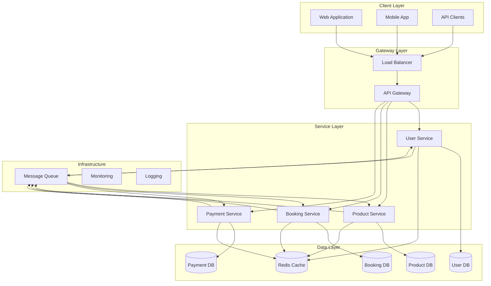
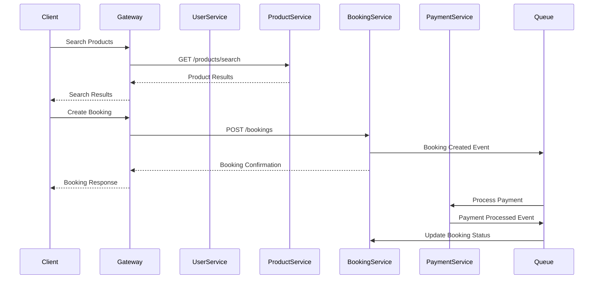
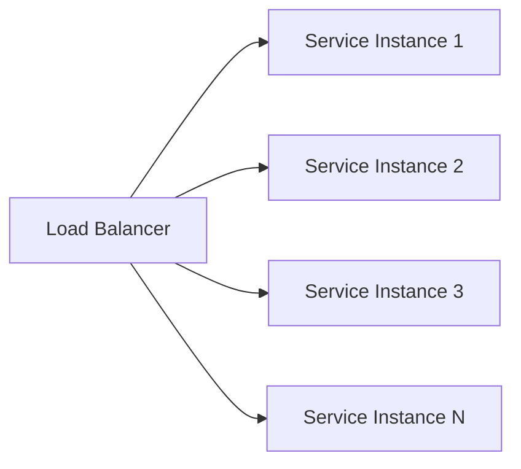
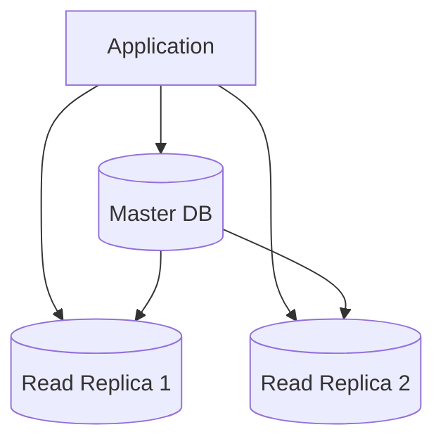
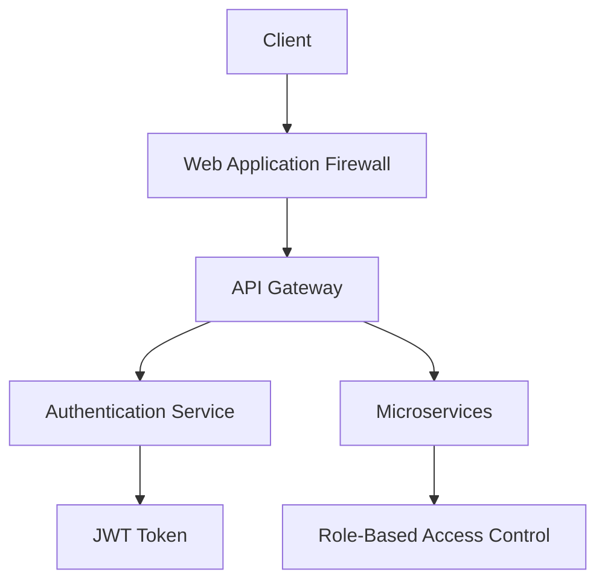

# Architecture Overview

TravelDen is built using a microservices architecture pattern, designed for scalability, maintainability, and fault tolerance.

## System Architecture

## Service Communication

## Design Principles

### 1. Microservices Architecture
- **Service Independence**: Each service can be developed, deployed, and scaled independently
- **Technology Diversity**: Services can use different technologies best suited for their domain
- **Fault Isolation**: Failure in one service doesn't cascade to others

### 2. Domain-Driven Design
- **Bounded Contexts**: Each service represents a distinct business domain
- **Ubiquitous Language**: Consistent terminology within each domain
- **Aggregate Boundaries**: Clear data ownership and consistency boundaries

### 3. Event-Driven Architecture
- **Asynchronous Communication**: Services communicate through events
- **Loose Coupling**: Services don't need direct knowledge of each other
- **Scalability**: Events can be processed at different rates

## Technology Stack

| Component | Technology | Purpose |
|-----------|------------|---------|
| **Runtime** | PHP 8.2 + Laravel | Application framework |
| **Database** | MySQL 8.0 | Primary data storage |
| **Cache** | Redis | Session storage and caching |
| **Queue** | Redis/RabbitMQ | Asynchronous message processing |
| **Gateway** | Nginx | Load balancing and routing |
| **Containerization** | Docker | Service packaging and deployment |
| **Orchestration** | Docker Compose | Local development environment |

## Scalability Patterns

### Horizontal Scaling

### Database Scaling

## Security Architecture

## Monitoring and Observability

- **Health Checks**: Each service exposes health endpoints
- **Metrics Collection**: Application and infrastructure metrics
- **Distributed Tracing**: Request tracing across services
- **Centralized Logging**: Aggregated logs from all services
- **Alerting**: Proactive monitoring and alerting

## Next Steps

- [System Design Details](system-design.md)
- [Database Schema](database-schema.md)
- [API Documentation](../api/getting-started.md)
- [Deployment Guide](../deployment/docker.md)