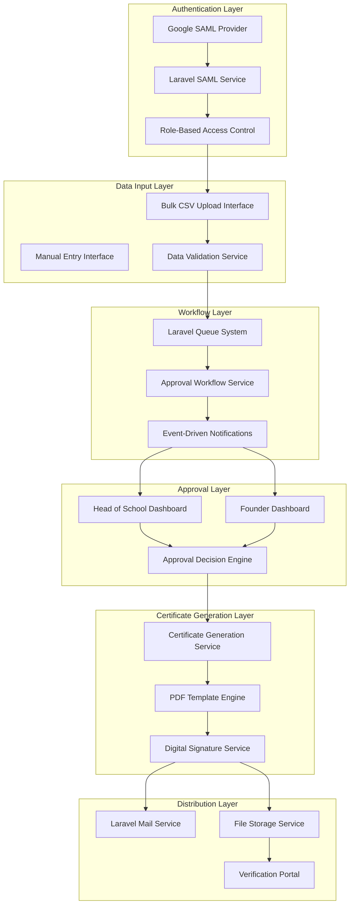

# Lagos Aviation Academy Certificate Automation System
## Laravel Implementation Guide with Google SAML Authentication

### Document Information
- **Version**: 2.0
- **Date**: August 14, 2025
- **Framework**: Laravel 11.x
- **Authentication**: Google SAML
- **Status**: Implementation Ready
- **Classification**: Internal Technical Documentation

---

## Table of Contents

1. [System Overview](#1-system-overview)
2. [Architecture Design](#2-architecture-design)
3. [Authentication Implementation](#3-authentication-implementation)
4. [Data Models and Schemas](#4-data-models-and-schemas)
5. [API Specifications](#5-api-specifications)
6. [Workflow Implementations](#6-workflow-implementations)
7. [Security Best Practices](#7-security-best-practices)
8. [Certificate Generation Service](#8-certificate-generation-service)
9. [Testing and Validation](#9-testing-and-validation)
10. [Performance Optimization](#10-performance-optimization)

---

## 1. System Overview

### 1.1 Purpose
The Certificate Automation System streamlines the generation, approval, and distribution of graduation certificates for Lagos Aviation Academy using Laravel framework with Google SAML authentication, reducing processing time by 95% while maintaining enterprise-level security.

### 1.2 Scope
- Laravel-based certificate generation workflow
- Google SAML authentication for Head of School and School Founder
- Multi-stage approval process with role-based access
- Digital signature integration
- Certificate verification portal
- Bulk graduate data processing
- Automated email distribution system

### 1.3 Technology Stack
- **Framework**: Laravel 
- **Authentication**: Google SAML 2.0
- **Database**: MySQL 8.0+ / PostgreSQL 14+
- **Queue System**: Redis with Laravel Horizon
- **File Storage**: AWS S3 / Local Storage
- **PDF Generation**: DomPDF / wkhtmltopdf
- **Email Service**: Laravel Mail with SES/SMTP
- **Caching**: Redis
- **Testing**: PHPUnit with Feature/Unit tests

### 1.4 Key Stakeholders and Access Control
| Role | Responsibilities | SAML Email Domain | System Access |
|------|-----------------|-------------------|---------------|
| School Administrator | Data upload, template management | admin@lagosaviationacademy.edu.ng | Full system access |
| Head of School | First-level approval | head@lagosaviationacademy.edu.ng | Approval dashboard |
| School Founder | Final approval, signature | founder@lagosaviationacademy.edu.ng | Executive dashboard |
| IT Support | System maintenance | it@lagosaviationacademy.edu.ng | Administrative access |

---

## 2. Architecture Design

### 2.1 Laravel Application Structure

```
app/
├── Console/Commands/
│   ├── ProcessCertificateBatch.php
│   └── GenerateCertificates.php
├── Events/
│   ├── BatchApproved.php
│   └── CertificateGenerated.php
├── Http/
│   ├── Controllers/
│   │   ├── Auth/SamlController.php
│   │   ├── CertificateController.php
│   │   ├── ApprovalController.php
│   │   └── VerificationController.php
│   ├── Middleware/
│   │   ├── SamlAuthenticated.php
│   │   └── RoleBasedAccess.php
│   └── Requests/
│       ├── BulkUploadRequest.php
│       └── ApprovalRequest.php
├── Jobs/
│   ├── GenerateCertificateJob.php
│   ├── SendApprovalNotification.php
│   └── ProcessBulkUpload.php
├── Listeners/
│   ├── SendCertificateEmail.php
│   └── UpdateBatchStatus.php
├── Models/
│   ├── Graduate.php
│   ├── CertificateBatch.php
│   ├── Certificate.php
│   └── User.php
├── Services/
│   ├── SamlAuthService.php
│   ├── CertificateGenerationService.php
│   ├── ApprovalWorkflowService.php
│   └── EmailNotificationService.php
└── Traits/
    ├── HasApprovalWorkflow.php
    └── GeneratesCertificates.php
```

### 2.2 High-Level Architecture Flow



---

## 3. Authentication Implementation

### 3.1 Google SAML Configuration

#### 3.1.1 SAML Service Provider Setup

```php
<?php

namespace App\Services;

use Illuminate\Support\Facades\Auth;
use Illuminate\Support\Facades\Log;
use OneLogin\Saml2\Auth as SamlAuth;
use OneLogin\Saml2\Settings;
use OneLogin\Saml2\Utils;
use App\Models\User;

class SamlAuthService
{
    private $samlAuth;
    private $settings;

    public function __construct()
    {
        $this->settings = [
            'sp' => [
                'entityId' => config('saml.sp.entityId'),
                'assertionConsumerService' => [
                    'url' => route('saml.acs'),
                    'binding' => 'urn:oasis:names:tc:SAML:2.0:bindings:HTTP-POST',
                ],
                'singleLogoutService' => [
                    'url' => route('saml.sls'),
                    'binding' => 'urn:oasis:names:tc:SAML:2.0:bindings:HTTP-Redirect',
                ],
                'NameIDFormat' => 'urn:oasis:names:tc:SAML:1.1:nameid-format:emailAddress',
                'x509cert' => config('saml.sp.x509cert'),
                'privateKey' => config('saml.sp.privateKey'),
            ],
            'idp' => [
                'entityId' => config('saml.idp.entityId'),
                'singleSignOnService' => [
                    'url' => config('saml.idp.singleSignOnService'),
                    'binding' => 'urn:oasis:names:tc:SAML:2.0:bindings:HTTP-Redirect',
                ],
                'singleLogoutService' => [
                    'url' => config('saml.idp.singleLogoutService'),
                    'binding' => 'urn:oasis:names:tc:SAML:2.0:bindings:HTTP-Redirect',
                ],
                'x509cert' => config('saml.idp.x509cert'),
            ],
            'security' => [
                'nameIdEncrypted' => false,
                'authnRequestsSigned' => true,
                'logoutRequestSigned' => true,
                'logoutResponseSigned' => true,
                'signMetadata' => true,
                'wantAssertionsSigned' => true,
                'wantNameId' => true,
                'wantAssertionsEncrypted' => false,
                'wantNameIdEncrypted' => false,
                'requestedAuthnContext' => true,
                'signatureAlgorithm' => 'http://www.w3.org/2001/04/xmldsig-more#rsa-sha256',
                'digestAlgorithm' => 'http://www.w3.org/2001/04/xmlenc#sha256',
            ],
        ];

        $this->samlAuth = new SamlAuth($this->settings);
    }

    /**
     * Initiate SAML login process
     */
    public function login(): void
    {
        $this->samlAuth->login();
    }

    /**
     * Process SAML response and authenticate user
     */
    public function processResponse(): array
    {
        $this->samlAuth->processResponse();

        if (!$this->samlAuth->isAuthenticated()) {
            $errors = $this->samlAuth->getErrors();
            Log::error('SAML Authentication failed', ['errors' => $errors]);
            
            return [
                'success' => false,
                'errors' => $errors,
                'last_error_reason' => $this->samlAuth->getLastErrorReason()
            ];
        }

        $attributes = $this->samlAuth->getAttributes();
        $nameId = $this->samlAuth->getNameId();
        
        // Extract email from SAML response
        $email = $nameId; // Assuming NameID format is email
        
        // Validate authorized email domains
        if (!$this->isAuthorizedEmail($email)) {
            Log::warning('Unauthorized SAML login attempt', ['email' => $email]);
            return [
                'success' => false,
                'errors' => ['Unauthorized email domain'],
                'email' => $email
            ];
        }

        // Create or update user
        $user = $this->createOrUpdateUser($email, $attributes);
        
        // Authenticate user in Laravel
        Auth::login($user);
        
        Log::info('SAML authentication successful', ['email' => $email]);
        
        return [
            'success' => true,
            'user' => $user,
            'email' => $email
        ];
    }

    /**
     * Check if email is from authorized domain
     */
    private function isAuthorizedEmail(string $email): bool
    {
        $authorizedEmails = [
            'head@lagosaviationacademy.edu.ng',
            'founder@lagosaviationacademy.edu.ng',
            'admin@lagosaviationacademy.edu.ng',
            'it@lagosaviationacademy.edu.ng'
        ];

        return in_array($email, $authorizedEmails);
    }

    /**
     * Create or update user from SAML attributes
     */
    private function createOrUpdateUser(string $email, array $attributes): User
    {
        $userData = [
            'email' => $email,
            'name' => $attributes['displayName'][0] ?? $email,
            'role' => $this->determineUserRole($email),
            'last_saml_login' => now(),
        ];

        return User::updateOrCreate(
            ['email' => $email],
            $userData
        );
    }

    /**
     * Determine user role based on email
     */
    private function determineUserRole(string $email): string
    {
        return match ($email) {
            'head@lagosaviationacademy.edu.ng' => 'head_of_school',
            'founder@lagosaviationacademy.edu.ng' => 'school_founder',
            'admin@lagosaviationacademy.edu.ng' => 'administrator',
            'it@lagosaviationacademy.edu.ng' => 'it_support',
            default => 'unauthorized'
        };
    }

    /**
     * Initiate SAML logout
     */
    public function logout(): void
    {
        $this->samlAuth->logout();
    }
}
```

#### 3.1.2 SAML Controller Implementation

```php
<?php

namespace App\Http\Controllers\Auth;

use App\Http\Controllers\Controller;
use App\Services\SamlAuthService;
use Illuminate\Http\Request;
use Illuminate\Support\Facades\Auth;

class SamlController extends Controller
{
    private SamlAuthService $samlService;

    public function __construct(SamlAuthService $samlService)
    {
        $this->samlService = $samlService;
    }

    /**
     * Initiate SAML login
     */
    public function login()
    {
        $this->samlService->login();
    }

    /**
     * Handle SAML assertion consumer service
     */
    public function acs(Request $request)
    {
        $result = $this->samlService->processResponse();

        if (!$result['success']) {
            return redirect()->route('login')
                ->withErrors(['saml' => 'Authentication failed: ' . implode(', ', $result['errors'])]);
        }

        // Redirect based on user role
        $user = $result['user'];
        
        return match ($user->role) {
            'head_of_school' => redirect()->route('approval.dashboard'),
            'school_founder' => redirect()->route('founder.dashboard'),
            'administrator' => redirect()->route('admin.dashboard'),
            'it_support' => redirect()->route('admin.dashboard'),
            default => redirect()->route('unauthorized')
        };
    }

    /**
     * Handle SAML single logout service
     */
    public function sls(Request $request)
    {
        Auth::logout();
        $this->samlService->logout();
        
        return redirect()->route('login')
            ->with('message', 'Successfully logged out');
    }

    /**
     * Display SAML metadata
     */
    public function metadata()
    {
        $settings = new \OneLogin\Saml2\Settings([
            'sp' => config('saml.sp'),
            'idp' => config('saml.idp')
        ]);

        $metadata = $settings->getSPMetadata();
        $errors = $settings->checkSPSettings();

        if (empty($errors)) {
            return response($metadata, 200, ['Content-Type' => 'text/xml']);
        }

        return response()->json(['errors' => $errors], 500);
    }
}
```

#### 3.1.3 SAML Middleware

```php
<?php

namespace App\Http\Middleware;

use Closure;
use Illuminate\Http\Request;
use Illuminate\Support\Facades\Auth;

class SamlAuthenticated
{
    /**
     * Handle an incoming request.
     */
    public function handle(Request $request, Closure $next, ...$roles)
    {
        if (!Auth::check()) {
            return redirect()->route('saml.login');
        }

        $user = Auth::user();

        // Check if user has required role
        if (!empty($roles) && !in_array($user->role, $roles)) {
            abort(403, 'Insufficient permissions');
        }

        // Verify user is still authorized
        if ($user->role === 'unauthorized') {
            Auth::logout();
            return redirect()->route('login')
                ->withErrors(['auth' => 'Your account is not authorized to access this system']);
        }

        return $next($request);
    }
}
```

---

## 4. Data Models and Schemas

### 4.1 User Model

```php
<?php

namespace App\Models;

use Illuminate\Database\Eloquent\Factories\HasFactory;
use Illuminate\Foundation\Auth\User as Authenticatable;
use Illuminate\Notifications\Notifiable;

class User extends Authenticatable
{
    use HasFactory, Notifiable;

    protected $fillable = [
        'name',
        'email',
        'role',
        'last_saml_login',
        'is_active',
    ];

    protected $casts = [
        'last_saml_login' => 'datetime',
        'is_active' => 'boolean',
    ];

    protected $hidden = [
        'remember_token',
    ];

    /**
     * Check if user can approve certificates
     */
    public function canApprove(): bool
    {
        return in_array($this->role, ['head_of_school', 'school_founder']);
    }

    /**
     * Check if user is head of school
     */
    public function isHeadOfSchool(): bool
    {
        return $this->role === 'head_of_school';
    }

    /**
     * Check if user is school founder
     */
    public function isSchoolFounder(): bool
    {
        return $this->role === 'school_founder';
    }

    /**
     * Check if user is administrator
     */
    public function isAdministrator(): bool
    {
        return $this->role === 'administrator';
    }
}
```

### 4.2 Graduate Model

```php
<?php

namespace App\Models;

use Illuminate\Database\Eloquent\Factories\HasFactory;
use Illuminate\Database\Eloquent\Model;
use Illuminate\Database\Eloquent\Relations\BelongsTo;
use Illuminate\Database\Eloquent\Relations\HasOne;

class Graduate extends Model
{
    use HasFactory;

    protected $fillable = [
        'certificate_batch_id',
        'name',
        'email',
        'department',
        'graduation_date',
        'certificate_id',
        'approval_status',
        'head_approval_date',
        'founder_approval_date',
        'head_approved_by',
        'founder_approved_by',
        'rejection_reason',
    ];

    protected $casts = [
        'graduation_date' => 'date',
        'head_approval_date' => 'datetime',
        'founder_approval_date' => 'datetime',
    ];

    /**
     * Get the certificate batch
     */
    public function batch(): BelongsTo
    {
        return $this->belongsTo(CertificateBatch::class, 'certificate_batch_id');
    }

    /**
     * Get the certificate
     */
    public function certificate(): HasOne
    {
        return $this->hasOne(Certificate::class);
    }

    /**
     * Get head approver
     */
    public function headApprover(): BelongsTo
    {
        return $this->belongsTo(User::class, 'head_approved_by');
    }

    /**
     * Get founder approver
     */
    public function founderApprover(): BelongsTo
    {
        return $this->belongsTo(User::class, 'founder_approved_by');
    }

    /**
     * Check if graduate is approved by head
     */
    public function isHeadApproved(): bool
    {
        return $this->approval_status === 'head_approved' || $this->approval_status === 'final_approved';
    }

    /**
     * Check if graduate is finally approved
     */
    public function isFinalApproved(): bool
    {
        return $this->approval_status === 'final_approved';
    }

    /**
     * Check if graduate is rejected
     */
    public function isRejected(): bool
    {
        return in_array($this->approval_status, ['rejected_by_head', 'rejected_by_founder']);
    }

    /**
     * Check if graduate is rejected by head
     */
    public function isRejectedByHead(): bool
    {
        return $this->approval_status === 'rejected_by_head';
    }

    /**
     * Check if graduate is rejected by founder
     */
    public function isRejectedByFounder(): bool
    {
        return $this->approval_status === 'rejected_by_founder';
    }

    /**
     * Scope for pending approval
     */
    public function scopePendingApproval($query)
    {
        return $query->where('approval_status', 'pending');
    }

    /**
     * Scope for head approved
     */
    public function scopeHeadApproved($query)
    {
        return $query->where('approval_status', 'head_approved');
    }

    /**
     * Scope for final approved
     */
    public function scopeFinalApproved($query)
    {
        return $query->where('approval_status', 'final_approved');
    }
}
```

### 4.3 Certificate Batch Model

```php
<?php

namespace App\Models;

use Illuminate\Database\Eloquent\Factories\HasFactory;
use Illuminate\Database\Eloquent\Model;
use Illuminate\Database\Eloquent\Relations\HasMany;
use Illuminate\Database\Eloquent\Relations\BelongsTo;

class CertificateBatch extends Model
{
    use HasFactory;

    protected $fillable = [
        'batch_name',
        'department',
        'graduation_date',
        'total_graduates',
        'approved_count',
        'batch_status',
        'created_by',
        'template_type',
        'csv_file_path',
        'head_approval_token',
        'head_approval_submitted',
    ];

    protected $casts = [
        'graduation_date' => 'date',
        'total_graduates' => 'integer',
        'approved_count' => 'integer',
        'head_approval_submitted' => 'boolean',
    ];

    /**
     * Get all graduates in this batch
     */
    public function graduates(): HasMany
    {
        return $this->hasMany(Graduate::class);
    }

    /**
     * Get the user who created this batch
     */
    public function creator(): BelongsTo
    {
        return $this->belongsTo(User::class, 'created_by');
    }

    /**
     * Get pending graduates
     */
    public function pendingGraduates(): HasMany
    {
        return $this->graduates()->where('approval_status', 'pending');
    }

    /**
     * Get approved graduates
     */
    public function approvedGraduates(): HasMany
    {
        return $this->graduates()->where('approval_status', 'final_approved');
    }

    /**
     * Check if batch is ready for head approval
     */
    public function isReadyForHeadApproval(): bool
    {
        return $this->batch_status === 'pending_head_approval';
    }

    /**
     * Check if batch is ready for founder approval
     */
    public function isReadyForFounderApproval(): bool
    {
        return $this->batch_status === 'pending_founder_approval';
    }

    /**
     * Update batch status based on graduate approvals
     */
    public function updateBatchStatus(): void
    {
        $totalGraduates = $this->graduates()->count();
        $pendingCount = $this->graduates()->where('approval_status', 'pending')->count();
        $headApprovedCount = $this->graduates()->where('approval_status', 'head_approved')->count();
        $finalApprovedCount = $this->graduates()->where('approval_status', 'final_approved')->count();
        $rejectedCount = $this->graduates()->whereIn('approval_status', ['rejected_by_head', 'rejected_by_founder'])->count();

        // Determine batch status based on graduate statuses
        if ($finalApprovedCount === $totalGraduates) {
            $this->batch_status = 'completed';
        } elseif ($pendingCount === 0 && $headApprovedCount === 0) {
            // All graduates have been processed (approved or rejected)
            $this->batch_status = 'processing_completed';
        } elseif ($headApprovedCount > 0 && $pendingCount === 0) {
            // All pending graduates have been processed by head, some approved
            $this->batch_status = 'pending_founder_approval';
        } elseif ($headApprovedCount > 0 || $rejectedCount > 0) {
            // Some graduates have been processed
            $this->batch_status = 'partial_processed';
        } else {
            // All graduates are still pending
            $this->batch_status = 'pending_head_approval';
        }

        $this->approved_count = $finalApprovedCount;
        $this->save();
    }
}
```

### 4.4 Certificate Model

```php
<?php

namespace App\Models;

use Illuminate\Database\Eloquent\Factories\HasFactory;
use Illuminate\Database\Eloquent\Model;
use Illuminate\Database\Eloquent\Relations\BelongsTo;

class Certificate extends Model
{
    use HasFactory;

    protected $fillable = [
        'graduate_id',
        'certificate_number',
        'file_path',
        'file_url',
        'verification_code',
        'generated_at',
        'sent_at',
        'is_verified',
        'verification_count',
    ];

    protected $casts = [
        'generated_at' => 'datetime',
        'sent_at' => 'datetime',
        'is_verified' => 'boolean',
        'verification_count' => 'integer',
    ];

    /**
     * Get the graduate
     */
    public function graduate(): BelongsTo
    {
        return $this->belongsTo(Graduate::class);
    }

    /**
     * Generate verification code
     */
    public static function generateVerificationCode(): string
    {
        return strtoupper(substr(md5(uniqid(rand(), true)), 0, 8));
    }

    /**
     * Get verification URL
     */
    public function getVerificationUrlAttribute(): string
    {
        return route('certificate.verify', ['code' => $this->verification_code]);
    }

    /**
     * Increment verification count
     */
    public function incrementVerificationCount(): void
    {
        $this->increment('verification_count');
    }
}
```

---

## 5. API Specifications

### 5.1 Certificate Generation API

#### 5.1.1 Generate Certificates Endpoint

```php
<?php

namespace App\Http\Controllers;

use App\Http\Requests\GenerateCertificatesRequest;
use App\Jobs\GenerateCertificateJob;
use App\Models\CertificateBatch;
use App\Services\CertificateGenerationService;
use Illuminate\Http\JsonResponse;

class CertificateController extends Controller
{
    private CertificateGenerationService $certificateService;

    public function __construct(CertificateGenerationService $certificateService)
    {
        $this->certificateService = $certificateService;
        $this->middleware(['auth:saml', 'role:administrator,head_of_school,school_founder']);
    }

    /**
     * Generate certificates for approved graduates
     */
    public function generate(GenerateCertificatesRequest $request): JsonResponse
    {
        $batchId = $request->validated()['batch_id'];
        $batch = CertificateBatch::findOrFail($batchId);

        // Verify batch is ready for certificate generation
        if (!$batch->isReadyForCertificateGeneration()) {
            return response()->json([
                'success' => false,
                'message' => 'Batch is not ready for certificate generation'
            ], 400);
        }

        // Queue certificate generation jobs
        $approvedGraduates = $batch->approvedGraduates;
        
        foreach ($approvedGraduates as $graduate) {
            GenerateCertificateJob::dispatch($graduate);
        }

        // Update batch status
        $batch->update(['batch_status' => 'generating_certificates']);

        return response()->json([
            'success' => true,
            'message' => 'Certificate generation started',
            'batch_id' => $batchId,
            'total_certificates' => $approvedGraduates->count()
        ]);
    }

    /**
     * Get certificate generation status
     */
    public function status(int $batchId): JsonResponse
    {
        $batch = CertificateBatch::with(['graduates.certificate'])->findOrFail($batchId);
        
        $totalGraduates = $batch->graduates->count();
        $generatedCertificates = $batch->graduates->whereNotNull('certificate')->count();
        
        return response()->json([
            'batch_id' => $batchId,
            'batch_status' => $batch->batch_status,
            'total_graduates' => $totalGraduates,
            'generated_certificates' => $generatedCertificates,
            'progress_percentage' => $totalGraduates > 0 ? ($generatedCertificates / $totalGraduates) * 100 : 0
        ]);
    }

    /**
     * Download certificate
     */
    public function download(int $certificateId): \Symfony\Component\HttpFoundation\BinaryFileResponse
    {
        $certificate = Certificate::findOrFail($certificateId);
        
        // Security check - ensure user can access this certificate
        if (!$this->canAccessCertificate($certificate)) {
            abort(403, 'Unauthorized access to certificate');
        }

        return response()->download(storage_path('app/' . $certificate->file_path));
    }

    /**
     * Check if user can access certificate
     */
    private function canAccessCertificate(Certificate $certificate): bool
    {
        $user = auth()->user();
        
        // Administrators and approvers can access all certificates
        if (in_array($user->role, ['administrator', 'head_of_school', 'school_founder'])) {
            return true;
        }

        return false;
    }
}
```

#### 5.1.2 Certificate Verification API

```php
<?php

namespace App\Http\Controllers;

use App\Models\Certificate;
use Illuminate\Http\JsonResponse;
use Illuminate\Http\Request;

class VerificationController extends Controller
{
    /**
     * Verify certificate by verification code
     */
    public function verify(Request $request): JsonResponse
    {
        $request->validate([
            'verification_code' => 'required|string|size:8'
        ]);

        $certificate = Certificate::with('graduate')
            ->where('verification_code', strtoupper($request->verification_code))
            ->first();

        if (!$certificate) {
            return response()->json([
                'success' => false,
                'message' => 'Certificate not found or invalid verification code'
            ], 404);
        }

        // Increment verification count
        $certificate->incrementVerificationCount();

        return response()->json([
            'success' => true,
            'certificate' => [
                'certificate_number' => $certificate->certificate_number,
                'graduate_name' => $certificate->graduate->name,
                'department' => $certificate->graduate->department,
                'graduation_date' => $certificate->graduate->graduation_date->format('Y-m-d'),
                'generated_at' => $certificate->generated_at->format('Y-m-d H:i:s'),
                'verification_count' => $certificate->verification_count,
                'is_authentic' => true
            ]
        ]);
    }

    /**
     * Get certificate verification statistics
     */
    public function statistics(): JsonResponse
    {
        $totalCertificates = Certificate::count();
        $verifiedCertificates = Certificate::where('verification_count', '>', 0)->count();
        $totalVerifications = Certificate::sum('verification_count');

        return response()->json([
            'total_certificates' => $totalCertificates,
            'verified_certificates' => $verifiedCertificates,
            'total_verifications' => $totalVerifications,
            'verification_rate' => $totalCertificates > 0 ? ($verifiedCertificates / $totalCertificates) * 100 : 0
        ]);
    }
}
```

---

## 6. Workflow Implementations

### 6.1 Approval Workflow Service

```php
<?php

namespace App\Services;

use App\Events\BatchApproved;
use App\Jobs\SendApprovalNotification;
use App\Jobs\SendIndividualApprovalNotification;
use App\Jobs\SendBatchApprovalNotification;
use App\Jobs\GenerateCertificateJob;
use App\Models\CertificateBatch;
use App\Models\Graduate;
use App\Models\User;
use Illuminate\Support\Facades\DB;
use Illuminate\Support\Facades\Log;

class ApprovalWorkflowService
{
    /**
     * Process individual head of school approval/rejection
     */
    public function processHeadApproval(Graduate $graduate, User $approver, string $action, ?string $comments = null): array
    {
        try {
            DB::beginTransaction();

            // Validate approver role
            if (!$approver->isHeadOfSchool()) {
                throw new \Exception('User is not authorized to perform head approval');
            }

            // Validate graduate is in pending status
            if ($graduate->approval_status !== 'pending') {
                throw new \Exception('Graduate is not in pending status for head approval');
            }

            // Update graduate record based on action
            if ($action === 'approve') {
                $graduate->update([
                    'approval_status' => 'head_approved',
                    'head_approval_date' => now(),
                    'head_approved_by' => $approver->id,
                    'head_approval_comments' => $comments,
                ]);

                // Send individual notification to founder for this specific graduate
                $founder = User::where('role', 'school_founder')->first();
                if ($founder) {
                    SendIndividualApprovalNotification::dispatch($graduate, $founder, 'founder_approval');
                }

                $message = 'Graduate approved by Head of School and forwarded to Founder';
            } else {
                $graduate->update([
                    'approval_status' => 'rejected_by_head',
                    'head_approval_date' => now(),
                    'head_approved_by' => $approver->id,
                    'rejection_reason' => $comments ?? 'Rejected by Head of School',
                ]);

                $message = 'Graduate rejected by Head of School';
            }

            // Update batch status based on all graduates in batch
            $graduate->batch->updateBatchStatus();

            // Log approval action
            Log::info('Head approval processed for individual graduate', [
                'graduate_id' => $graduate->id,
                'graduate_name' => $graduate->name,
                'batch_id' => $graduate->certificate_batch_id,
                'approver_id' => $approver->id,
                'action' => $action,
                'comments' => $comments
            ]);

            DB::commit();

            return [
                'success' => true,
                'message' => $message,
                'graduate_id' => $graduate->id,
                'new_status' => $graduate->approval_status
            ];

        } catch (\Exception $e) {
            DB::rollBack();
            Log::error('Head approval failed for individual graduate', [
                'graduate_id' => $graduate->id,
                'error' => $e->getMessage()
            ]);

            return [
                'success' => false,
                'error' => $e->getMessage()
            ];
        }
    }

    /**
     * Process individual founder approval/rejection
     */
    public function processFounderApproval(Graduate $graduate, User $approver, string $action, ?string $comments = null): array
    {
        try {
            DB::beginTransaction();

            // Validate approver role
            if (!$approver->isSchoolFounder()) {
                throw new \Exception('User is not authorized to perform founder approval');
            }

            // Validate graduate is in head_approved status
            if ($graduate->approval_status !== 'head_approved') {
                throw new \Exception('Graduate must be approved by Head of School first');
            }

            // Update graduate record based on action
            if ($action === 'approve') {
                $graduate->update([
                    'approval_status' => 'final_approved',
                    'founder_approval_date' => now(),
                    'founder_approved_by' => $approver->id,
                    'founder_approval_comments' => $comments,
                ]);

                // Trigger certificate generation for this individual graduate
                GenerateCertificateJob::dispatch($graduate);

                $message = 'Graduate finally approved by Founder - certificate generation initiated';
            } else {
                $graduate->update([
                    'approval_status' => 'rejected_by_founder',
                    'founder_approval_date' => now(),
                    'founder_approved_by' => $approver->id,
                    'rejection_reason' => $comments ?? 'Rejected by Founder',
                ]);

                $message = 'Graduate rejected by Founder';
            }

            // Update batch status based on all graduates in batch
            $graduate->batch->updateBatchStatus();

            // Log approval action
            Log::info('Founder approval processed for individual graduate', [
                'graduate_id' => $graduate->id,
                'graduate_name' => $graduate->name,
                'batch_id' => $graduate->certificate_batch_id,
                'approver_id' => $approver->id,
                'action' => $action,
                'comments' => $comments
            ]);

            DB::commit();

            return [
                'success' => true,
                'message' => $message,
                'graduate_id' => $graduate->id,
                'new_status' => $graduate->approval_status
            ];

        } catch (\Exception $e) {
            DB::rollBack();
            Log::error('Founder approval failed for individual graduate', [
                'graduate_id' => $graduate->id,
                'error' => $e->getMessage()
            ]);

            return [
                'success' => false,
                'error' => $e->getMessage()
            ];
        }
    }

    /**
     * Send initial approval request to Head of School for entire batch
     */
    public function initiateApprovalProcess(CertificateBatch $batch): array
    {
        try {
            // Update batch status to indicate approval process has started
            $batch->update(['batch_status' => 'pending_head_approval']);

            // Send email notification to Head of School with list of all graduates
            $headOfSchool = User::where('role', 'head_of_school')->first();
            
            Mail::to($headOfSchool->email)
                ->send(new BatchApprovalRequest($batch));

            return [
                'success' => true,
                'message' => 'Approval request sent successfully'
            ];
        } catch (\Exception $e) {
            return [
                'success' => false,
                'error' => $e->getMessage()
            ];
        }
    }
}
```

### 6.2 Enhanced CSV Validation and Batch Processing

#### 6.2.1 CSV Format Validation Service

```php
<?php

namespace App\Services;

use Illuminate\Support\Facades\Log;

class CsvValidationService
{
    /**
     * Validate CSV format matches required structure exactly
     */
    public function validateCsvFormat(array $data): void
    {
        if (empty($data)) {
            throw new \Exception('CSV file is empty');
        }

        // Required columns in exact order
        $requiredColumns = ['Name', 'Department', 'GraduationDate', 'CertificateID'];
        $firstRow = $data[0];
        $actualColumns = array_keys($firstRow);

        // Check if all required columns are present
        $missingColumns = array_diff($requiredColumns, $actualColumns);
        if (!empty($missingColumns)) {
            throw new \Exception('Missing required columns: ' . implode(', ', $missingColumns));
        }

        // Check for extra columns that are not allowed
        $allowedColumns = ['Name', 'Department', 'GraduationDate', 'CertificateID'];
        $extraColumns = array_diff($actualColumns, $allowedColumns);
        if (!empty($extraColumns)) {
            throw new \Exception('Invalid columns found: ' . implode(', ', $extraColumns) . '. Only allowed columns: ' . implode(', ', $allowedColumns));
        }

        // Validate column order matches expected format exactly
        if ($actualColumns !== $requiredColumns) {
            throw new \Exception('Columns must be in the exact order: ' . implode(', ', $requiredColumns) . '. Found: ' . implode(', ', $actualColumns));
        }

        // Validate data format for each row
        foreach ($data as $index => $row) {
            $this->validateRowFormat($row, $index + 1);
        }

        Log::info('CSV format validation passed', [
            'columns' => $actualColumns,
            'total_rows' => count($data)
        ]);
    }

    /**
     * Validate individual row format
     */
    private function validateRowFormat(array $row, int $rowNumber): void
    {
        // Validate Name
        if (empty(trim($row['Name']))) {
            throw new \Exception("Row {$rowNumber}: Name cannot be empty");
        }

        // Validate Department
        $validDepartments = ['Flight Ops', 'Aviation Eng.'];
        if (!in_array($row['Department'], $validDepartments)) {
            throw new \Exception("Row {$rowNumber}: Invalid department '{$row['Department']}'. Must be one of: " . implode(', ', $validDepartments));
        }

        // Validate GraduationDate format (YYYY-MM-DD)
        if (!preg_match('/^\d{4}-\d{2}-\d{2}$/', $row['GraduationDate'])) {
            throw new \Exception("Row {$rowNumber}: Invalid graduation date format '{$row['GraduationDate']}'. Must be YYYY-MM-DD");
        }

        // Validate CertificateID format (LAA2025-001)
        if (!preg_match('/^LAA\d{4}-\d{3}$/', $row['CertificateID'])) {
            throw new \Exception("Row {$rowNumber}: Invalid certificate ID format '{$row['CertificateID']}'. Must be LAA2025-001 format");
        }
    }
}
```

#### 6.2.2 Enhanced ProcessBulkUpload Job

```php
<?php

namespace App\Jobs;

use App\Models\CertificateBatch;
use App\Models\Graduate;
use App\Services\CsvValidationService;
use App\Services\EmailNotificationService;
use Illuminate\Bus\Queueable;
use Illuminate\Contracts\Queue\ShouldQueue;
use Illuminate\Foundation\Bus\Dispatchable;
use Illuminate\Queue\InteractsWithQueue;
use Illuminate\Queue\SerializesModels;
use Illuminate\Support\Facades\DB;
use Illuminate\Support\Facades\Log;
use Illuminate\Support\Facades\Storage;

class ProcessBulkUpload implements ShouldQueue
{
    use Dispatchable, InteractsWithQueue, Queueable, SerializesModels;

    private CertificateBatch $batch;
    private string $csvFilePath;

    public function __construct(CertificateBatch $batch, string $csvFilePath)
    {
        $this->batch = $batch;
        $this->csvFilePath = $csvFilePath;
    }

    /**
     * Execute the job with enhanced validation
     */
    public function handle(CsvValidationService $csvValidator, EmailNotificationService $emailService): void
    {
        try {
            DB::beginTransaction();

            // Step 1: Read CSV file
            $csvData = $this->readCsvFile();
            
            // Step 2: Validate CSV format (NEW REQUIREMENT)
            $csvValidator->validateCsvFormat($csvData);
            
            // Step 3: Validate CSV data content
            $validatedData = $this->validateCsvData($csvData);
            
            // Step 4: Create graduate records
            $this->createGraduateRecords($validatedData);
            
            // Step 5: Generate approval token and update batch
            $approvalToken = $this->generateApprovalToken();
            $this->batch->update([
                'total_graduates' => count($validatedData),
                'batch_status' => 'validated_pending_head_approval',
                'head_approval_token' => $approvalToken,
                'head_approval_submitted' => false
            ]);

            // Step 6: Send approval email to Head of School with web link
            $headOfSchool = \App\Models\User::where('role', 'head_of_school')->first();
            if ($headOfSchool) {
                $emailService->sendBatchApprovalNotification($this->batch, $headOfSchool, 'head_approval');
            }

            DB::commit();

            Log::info('Bulk upload processed and validated successfully', [
                'batch_id' => $this->batch->id,
                'total_graduates' => count($validatedData),
                'approval_token' => $approvalToken
            ]);

        } catch (\Exception $e) {
            DB::rollBack();
            
            $this->batch->update(['batch_status' => 'validation_failed']);
            
            Log::error('Bulk upload processing failed', [
                'batch_id' => $this->batch->id,
                'error' => $e->getMessage()
            ]);

            throw $e;
        }
    }

    /**
     * Read CSV file
     */
    private function readCsvFile(): array
    {
        $csvContent = Storage::get($this->csvFilePath);
        $lines = explode("\n", $csvContent);
        $header = str_getcsv(array_shift($lines));
        
        $data = [];
        foreach ($lines as $line) {
            if (trim($line)) {
                $data[] = array_combine($header, str_getcsv($line));
            }
        }

        return $data;
    }

    /**
     * Validate CSV data content
     */
    private function validateCsvData(array $data): array
    {
        $validatedData = [];

        foreach ($data as $index => $row) {
            // Validate email format if provided
            if (!empty($row['Email']) && !filter_var($row['Email'], FILTER_VALIDATE_EMAIL)) {
                throw new \Exception("Invalid email format at row " . ($index + 2));
            }

            // Check for duplicate certificate IDs
            $existingGraduate = Graduate::where('certificate_id', $row['CertificateID'])->first();
            if ($existingGraduate) {
                throw new \Exception("Duplicate certificate ID '{$row['CertificateID']}' at row " . ($index + 2));
            }

            $validatedData[] = $row;
        }

        return $validatedData;
    }

    /**
     * Create graduate records
     */
    private function createGraduateRecords(array $data): void
    {
        foreach ($data as $row) {
            Graduate::create([
                'certificate_batch_id' => $this->batch->id,
                'name' => $row['Name'],
                'email' => $row['Email'] ?? null,
                'department' => $row['Department'],
                'graduation_date' => $row['GraduationDate'],
                'certificate_id' => $row['CertificateID'],
                'approval_status' => 'pending',
            ]);
        }
    }

    /**
     * Generate unique approval token for this batch
     */
    private function generateApprovalToken(): string
    {
        return hash('sha256', $this->batch->id . now()->timestamp . uniqid());
    }
}
```

### 6.3 Web-Based Approval System

#### 6.3.1 Approval Web Controller

```php
<?php

namespace App\Http\Controllers;

use App\Models\CertificateBatch;
use App\Models\Graduate;
use App\Services\ApprovalWorkflowService;
use Illuminate\Http\Request;
use Illuminate\Support\Facades\Auth;
use Illuminate\Support\Facades\Log;

class WebApprovalController extends Controller
{
    private ApprovalWorkflowService $approvalService;

    public function __construct(ApprovalWorkflowService $approvalService)
    {
        $this->approvalService = $approvalService;
    }

    /**
     * Display Head of School approval page
     */
    public function showHeadApprovalPage(Request $request, string $token)
    {
        $batch = CertificateBatch::where('head_approval_token', $token)->first();
        
        if (!$batch) {
            return view('approval.invalid-token');
        }

        if ($batch->head_approval_submitted) {
            return view('approval.already-submitted', ['batch' => $batch]);
        }

        $graduates = $batch->graduates()->where('approval_status', 'pending')->get();

        return view('approval.head-approval', [
            'batch' => $batch,
            'graduates' => $graduates,
            'token' => $token
        ]);
    }

    /**
     * Process Head of School approval submission
     */
    public function processHeadApproval(Request $request, string $token)
    {
        $batch = CertificateBatch::where('head_approval_token', $token)->first();
        
        if (!$batch || $batch->head_approval_submitted) {
            return response()->json(['success' => false, 'message' => 'Invalid or expired approval link'], 400);
        }

        $request->validate([
            'approvals' => 'required|array',
            'approvals.*' => 'required|in:approve,reject',
            'comments' => 'array',
            'comments.*' => 'nullable|string|max:500'
        ]);

        try {
            DB::beginTransaction();

            $approvedCount = 0;
            $rejectedCount = 0;
            $founderApprovalTokens = [];

            foreach ($request->approvals as $graduateId => $action) {
                $graduate = Graduate::findOrFail($graduateId);
                $comments = $request->comments[$graduateId] ?? null;

                if ($action === 'approve') {
                    $graduate->update([
                        'approval_status' => 'head_approved',
                        'head_approval_date' => now(),
                        'head_approved_by' => 1, // System user for web approvals
                        'head_approval_comments' => $comments,
                    ]);

                    // Generate founder approval token for this graduate
                    $founderToken = $this->generateFounderApprovalToken($graduate);
                    $graduate->update(['founder_approval_token' => $founderToken]);
                    $founderApprovalTokens[] = ['graduate' => $graduate, 'token' => $founderToken];
                    
                    $approvedCount++;
                } else {
                    $graduate->update([
                        'approval_status' => 'rejected_by_head',
                        'head_approval_date' => now(),
                        'head_approved_by' => 1,
                        'rejection_reason' => $comments ?? 'Rejected by Head of School',
                    ]);
                    
                    $rejectedCount++;
                }
            }

            // Mark batch as submitted
            $batch->update(['head_approval_submitted' => true]);

            // Send individual approval emails to Founder for approved graduates
            $founder = \App\Models\User::where('role', 'school_founder')->first();
            if ($founder) {
                foreach ($founderApprovalTokens as $tokenData) {
                    SendFounderApprovalNotification::dispatch($tokenData['graduate'], $founder, $tokenData['token']);
                }
            }

            DB::commit();

            Log::info('Head approval processed via web interface', [
                'batch_id' => $batch->id,
                'approved_count' => $approvedCount,
                'rejected_count' => $rejectedCount
            ]);

            return response()->json([
                'success' => true,
                'message' => "Processed {$approvedCount} approvals and {$rejectedCount} rejections",
                'approved_count' => $approvedCount,
                'rejected_count' => $rejectedCount
            ]);

        } catch (\Exception $e) {
            DB::rollBack();
            Log::error('Head approval processing failed', ['error' => $e->getMessage()]);
            
            return response()->json([
                'success' => false,
                'message' => 'Processing failed: ' . $e->getMessage()
            ], 500);
        }
    }

    /**
     * Display Founder approval page
     */
    public function showFounderApprovalPage(Request $request, string $token)
    {
        $graduate = Graduate::where('founder_approval_token', $token)->first();
        
        if (!$graduate) {
            return view('approval.invalid-token');
        }

        if ($graduate->founder_approval_submitted) {
            return view('approval.already-submitted', ['graduate' => $graduate]);
        }

        return view('approval.founder-approval', [
            'graduate' => $graduate,
            'batch' => $graduate->batch,
            'token' => $token
        ]);
    }

    /**
     * Process Founder approval submission
     */
    public function processFounderApproval(Request $request, string $token)
    {
        $graduate = Graduate::where('founder_approval_token', $token)->first();
        
        if (!$graduate || $graduate->founder_approval_submitted) {
            return response()->json(['success' => false, 'message' => 'Invalid or expired approval link'], 400);
        }

        $request->validate([
            'action' => 'required|in:approve,reject',
            'comments' => 'nullable|string|max:500'
        ]);

        try {
            DB::beginTransaction();

            if ($request->action === 'approve') {
                $graduate->update([
                    'approval_status' => 'final_approved',
                    'founder_approval_date' => now(),
                    'founder_approved_by' => 1, // System user for web approvals
                    'founder_approval_comments' => $request->comments,
                    'founder_approval_submitted' => true
                ]);

                // Trigger certificate generation
                GenerateCertificateJob::dispatch($graduate);
                
                $message = 'Graduate approved - certificate generation initiated';
            } else {
                $graduate->update([
                    'approval_status' => 'rejected_by_founder',
                    'founder_approval_date' => now(),
                    'founder_approved_by' => 1,
                    'rejection_reason' => $request->comments ?? 'Rejected by Founder',
                    'founder_approval_submitted' => true
                ]);
                
                $message = 'Graduate rejected';
            }

            DB::commit();

            Log::info('Founder approval processed via web interface', [
                'graduate_id' => $graduate->id,
                'action' => $request->action,
                'comments' => $request->comments
            ]);

            return response()->json([
                'success' => true,
                'message' => $message,
                'graduate_name' => $graduate->name,
                'new_status' => $graduate->approval_status
            ]);

        } catch (\Exception $e) {
            DB::rollBack();
            Log::error('Founder approval processing failed', ['error' => $e->getMessage()]);
            
            return response()->json([
                'success' => false,
                'message' => 'Processing failed: ' . $e->getMessage()
            ], 500);
        }
    }

    /**
     * Generate founder approval token for individual graduate
     */
    private function generateFounderApprovalToken(Graduate $graduate): string
    {
        return hash('sha256', $graduate->id . 'founder' . now()->timestamp . uniqid());
    }
}
```

#### 6.3.2 Enhanced Email Notification Service

```php
<?php

namespace App\Services;

use App\Models\CertificateBatch;
use App\Models\Graduate;
use App\Models\User;
use Illuminate\Support\Facades\Mail;
use Illuminate\Support\Facades\Log;

class EmailNotificationService
{
    /**
     * Send batch approval notification to Head of School with web link
     */
    public function sendBatchApprovalNotification(CertificateBatch $batch, User $approver, string $type): void
    {
        $approvalUrl = route('web-approval.head', ['token' => $batch->head_approval_token]);
        
        $emailData = [
            'approver_name' => $approver->name,
            'batch_name' => $batch->batch_name,
            'department' => $batch->department,
            'graduation_date' => $batch->graduation_date->format('F j, Y'),
            'total_graduates' => $batch->total_graduates,
            'approval_url' => $approvalUrl,
            'graduates' => $batch->graduates->map(function ($graduate) {
                return [
                    'id' => $graduate->id,
                    'name' => $graduate->name,
                    'department' => $graduate->department,
                    'certificate_id' => $graduate->certificate_id,
                ];
            })
        ];

        Mail::send('emails.batch-approval-web', $emailData, function ($message) use ($approver, $batch) {
            $message->to($approver->email, $approver->name)
                ->subject("Certificate Approval Required: {$batch->batch_name}")
                ->from(config('mail.from.address'), config('mail.from.name'));
        });

        Log::info('Batch approval email sent with web link', [
            'batch_id' => $batch->id,
            'approver_email' => $approver->email,
            'approval_url' => $approvalUrl
        ]);
    }

    /**
     * Send individual founder approval notification with web link
     */
    public function sendFounderApprovalNotification(Graduate $graduate, User $founder, string $token): void
    {
        $approvalUrl = route('web-approval.founder', ['token' => $token]);
        
        $emailData = [
            'founder_name' => $founder->name,
            'graduate_name' => $graduate->name,
            'graduate_id' => $graduate->id,
            'department' => $graduate->department,
            'graduation_date' => $graduate->graduation_date->format('F j, Y'),
            'certificate_id' => $graduate->certificate_id,
            'batch_name' => $graduate->batch->batch_name,
            'approval_url' => $approvalUrl,
            'head_approval_date' => $graduate->head_approval_date->format('F j, Y g:i A'),
            'head_approval_comments' => $graduate->head_approval_comments,
        ];

        Mail::send('emails.founder-approval-web', $emailData, function ($message) use ($founder, $graduate) {
            $message->to($founder->email, $founder->name)
                ->subject("Final Approval Required: {$graduate->name}")
                ->from(config('mail.from.address'), config('mail.from.name'));
        });

        Log::info('Founder approval email sent with web link', [
            'graduate_id' => $graduate->id,
            'founder_email' => $founder->email,
            'approval_url' => $approvalUrl
        ]);
    }
}
```

#### 6.3.3 Send Founder Approval Notification Job

```php
<?php

namespace App\Jobs;

use App\Models\Graduate;
use App\Models\User;
use App\Services\EmailNotificationService;
use Illuminate\Bus\Queueable;
use Illuminate\Contracts\Queue\ShouldQueue;
use Illuminate\Foundation\Bus\Dispatchable;
use Illuminate\Queue\InteractsWithQueue;
use Illuminate\Queue\SerializesModels;

class SendFounderApprovalNotification implements ShouldQueue
{
    use Dispatchable, InteractsWithQueue, Queueable, SerializesModels;

    public $tries = 3;
    public $timeout = 60;

    private Graduate $graduate;
    private User $founder;
    private string $token;

    public function __construct(Graduate $graduate, User $founder, string $token)
    {
        $this->graduate = $graduate;
        $this->founder = $founder;
        $this->token = $token;
        $this->onQueue('notifications');
    }

    /**
     * Execute the job
     */
    public function handle(EmailNotificationService $emailService): void
    {
        $emailService->sendFounderApprovalNotification($this->graduate, $this->founder, $this->token);
    }
}
```

### 6.3 Individual Approval Job Classes

#### 6.3.1 Send Individual Approval Notification Job

```php
<?php

namespace App\Jobs;

use App\Models\Graduate;
use App\Models\User;
use App\Services\EmailNotificationService;
use Illuminate\Bus\Queueable;
use Illuminate\Contracts\Queue\ShouldQueue;
use Illuminate\Foundation\Bus\Dispatchable;
use Illuminate\Queue\InteractsWithQueue;
use Illuminate\Queue\SerializesModels;
use Illuminate\Support\Facades\Log;

class SendIndividualApprovalNotification implements ShouldQueue
{
    use Dispatchable, InteractsWithQueue, Queueable, SerializesModels;

    public $tries = 3;
    public $timeout = 60;

    private Graduate $graduate;
    private User $approver;
    private string $notificationType;

    public function __construct(Graduate $graduate, User $approver, string $notificationType)
    {
        $this->graduate = $graduate;
        $this->approver = $approver;
        $this->notificationType = $notificationType;
        $this->onQueue('notifications');
    }

    /**
     * Execute the job
     */
    public function handle(EmailNotificationService $emailService): void
    {
        try {
            $emailService->sendIndividualApprovalNotification(
                $this->graduate,
                $this->approver,
                $this->notificationType
            );

            Log::info('Individual approval notification sent', [
                'graduate_id' => $this->graduate->id,
                'graduate_name' => $this->graduate->name,
                'approver_email' => $this->approver->email,
                'notification_type' => $this->notificationType
            ]);

        } catch (\Exception $e) {
            Log::error('Failed to send individual approval notification', [
                'graduate_id' => $this->graduate->id,
                'approver_email' => $this->approver->email,
                'error' => $e->getMessage()
            ]);

            throw $e;
        }
    }
}
```

#### 6.3.2 Send Batch Approval Notification Job

```php
<?php

namespace App\Jobs;

use App\Models\CertificateBatch;
use App\Models\User;
use App\Services\EmailNotificationService;
use Illuminate\Bus\Queueable;
use Illuminate\Contracts\Queue\ShouldQueue;
use Illuminate\Foundation\Bus\Dispatchable;
use Illuminate\Queue\InteractsWithQueue;
use Illuminate\Queue\SerializesModels;
use Illuminate\Support\Facades\Log;

class SendBatchApprovalNotification implements ShouldQueue
{
    use Dispatchable, InteractsWithQueue, Queueable, SerializesModels;

    public $tries = 3;
    public $timeout = 60;

    private CertificateBatch $batch;
    private User $approver;
    private string $notificationType;

    public function __construct(CertificateBatch $batch, User $approver, string $notificationType)
    {
        $this->batch = $batch;
        $this->approver = $approver;
        $this->notificationType = $notificationType;
        $this->onQueue('notifications');
    }

    /**
     * Execute the job
     */
    public function handle(EmailNotificationService $emailService): void
    {
        try {
            $emailService->sendBatchApprovalNotification(
                $this->batch,
                $this->approver,
                $this->notificationType
            );

            Log::info('Batch approval notification sent', [
                'batch_id' => $this->batch->id,
                'batch_name' => $this->batch->batch_name,
                'approver_email' => $this->approver->email,
                'notification_type' => $this->notificationType,
                'total_graduates' => $this->batch->total_graduates
            ]);

        } catch (\Exception $e) {
            Log::error('Failed to send batch approval notification', [
                'batch_id' => $this->batch->id,
                'approver_email' => $this->approver->email,
                'error' => $e->getMessage()
            ]);

            throw $e;
        }
    }
}
```

### 6.4 Individual Approval API Controllers

#### 6.4.1 Individual Approval Controller

```php
<?php

namespace App\Http\Controllers;

use App\Http\Requests\IndividualApprovalRequest;
use App\Models\Graduate;
use App\Services\ApprovalWorkflowService;
use Illuminate\Http\JsonResponse;
use Illuminate\Support\Facades\Auth;

class IndividualApprovalController extends Controller
{
    private ApprovalWorkflowService $approvalService;

    public function __construct(ApprovalWorkflowService $approvalService)
    {
        $this->approvalService = $approvalService;
        $this->middleware(['auth:saml', 'role:head_of_school,school_founder']);
    }

    /**
     * Process head of school approval for individual graduate
     */
    public function processHeadApproval(IndividualApprovalRequest $request, Graduate $graduate): JsonResponse
    {
        $user = Auth::user();
        
        if (!$user->isHeadOfSchool()) {
            return response()->json([
                'success' => false,

### 6.4 Web Routes for Approval System

```php
<?php

// routes/web.php

use App\Http\Controllers\WebApprovalController;
use Illuminate\Support\Facades\Route;

// Web-based approval routes (no authentication required - token-based)
Route::prefix('approval')->name('web-approval.')->group(function () {
    
    // Head of School approval routes
    Route::get('head/{token}', [WebApprovalController::class, 'showHeadApprovalPage'])
        ->name('head');
    
    Route::post('head/{token}', [WebApprovalController::class, 'processHeadApproval'])
        ->name('head.process');
    
    // Founder approval routes  
    Route::get('founder/{token}', [WebApprovalController::class, 'showFounderApprovalPage'])
        ->name('founder');
    
    Route::post('founder/{token}', [WebApprovalController::class, 'processFounderApproval'])
        ->name('founder.process');
});

// Public certificate verification (no authentication required)
Route::prefix('verify')->group(function () {
    Route::get('certificate/{code}', [VerificationController::class, 'showVerificationPage'])
        ->name('certificate.verify.page');
    
    Route::post('certificate', [VerificationController::class, 'verify'])
        ->name('certificate.verify');
});
```

### 6.5 Blade Templates for Web Approval

#### 6.5.1 Head of School Approval Template

```blade
{{-- resources/views/approval/head-approval.blade.php --}}
<!DOCTYPE html>
<html lang="en">
<head>
    <meta charset="UTF-8">
    <meta name="viewport" content="width=device-width, initial-scale=1.0">
    <title>Certificate Approval - Head of School</title>
    <meta name="csrf-token" content="{{ csrf_token() }}">
    <style>
        body { font-family: Arial, sans-serif; margin: 20px; background-color: #f5f5f5; }
        .container { max-width: 1200px; margin: 0 auto; background: white; padding: 30px; border-radius: 8px; box-shadow: 0 2px 10px rgba(0,0,0,0.1); }
        .header { text-align: center; margin-bottom: 30px; padding-bottom: 20px; border-bottom: 2px solid #007bff; }
        .batch-info { background: #f8f9fa; padding: 20px; border-radius: 5px; margin-bottom: 30px; }
        .graduates-table { width: 100%; border-collapse: collapse; margin-bottom: 30px; }
        .graduates-table th, .graduates-table td { padding: 12px; text-align: left; border-bottom: 1px solid #ddd; }
        .graduates-table th { background-color: #007bff; color: white; }
        .approval-controls { text-align: center; }
        .btn { padding: 10px 20px; margin: 5px; border: none; border-radius: 4px; cursor: pointer; font-size: 14px; }
        .btn-primary { background-color: #007bff; color: white; }
        .btn-success { background-color: #28a745; color: white; }
        .btn-danger { background-color: #dc3545; color: white; }
        .btn-secondary { background-color: #6c757d; color: white; }
        .comments-input { width: 100%; padding: 8px; border: 1px solid #ddd; border-radius: 4px; }
        .select-all-controls { margin-bottom: 20px; padding: 15px; background: #e9ecef; border-radius: 5px; }
        .status-message { padding: 15px; margin: 10px 0; border-radius: 4px; }
        .status-success { background-color: #d4edda; color: #155724; border: 1px solid #c3e6cb; }
        .status-error { background-color: #f8d7da; color: #721c24; border: 1px solid #f5c6cb; }
    </style>
</head>
<body>
    <div class="container">
        <div class="header">
            <h1>Certificate Approval Required</h1>
            <h2>Head of School Review</h2>
        </div>

        <div class="batch-info">
            <h3>Batch Information</h3>
            <p><strong>Batch Name:</strong> {{ $batch->batch_name }}</p>
            <p><strong>Department:</strong> {{ $batch->department }}</p>
            <p><strong>Graduation Date:</strong> {{ $batch->graduation_date->format('F j, Y') }}</p>
            <p><strong>Total Graduates:</strong> {{ $batch->total_graduates }}</p>
        </div>

        <div id="status-message" class="status-message" style="display: none;"></div>

        <form id="approval-form">
            <div class="select-all-controls">
                <h4>Bulk Actions:</h4>
                <button type="button" class="btn btn-success" onclick="selectAllApprove()">Approve All</button>
                <button type="button" class="btn btn-danger" onclick="selectAllReject()">Reject All</button>
                <button type="button" class="btn btn-secondary" onclick="clearAll()">Clear All</button>
            </div>

            <table class="graduates-table">
                <thead>
                    <tr>
                        <th>Name</th>
                        <th>Department</th>
                        <th>Certificate ID</th>
                        <th>Action</th>
                        <th>Comments</th>
                    </tr>
                </thead>
                <tbody>
                    @foreach($graduates as $graduate)
                    <tr>
                        <td>{{ $graduate->name }}</td>
                        <td>{{ $graduate->department }}</td>
                        <td>{{ $graduate->certificate_id }}</td>
                        <td>
                            <label>
                                <input type="radio" name="approvals[{{ $graduate->id }}]" value="approve"> Approve
                            </label>
                            <label style="margin-left: 15px;">
                                <input type="radio" name="approvals[{{ $graduate->id }}]" value="reject"> Reject
                            </label>
                        </td>
                        <td>
                            <input type="text" name="comments[{{ $graduate->id }}]" class="comments-input" placeholder="Optional comments..." maxlength="500">
                        </td>
                    </tr>
                    @endforeach
                </tbody>
            </table>

            <div class="approval-controls">
                <button type="submit" class="btn btn-primary" style="font-size: 16px; padding: 15px 30px;">
                    Submit Approvals
                </button>
                <p style="margin-top: 15px; color: #666; font-style: italic;">
                    Note: This form can only be submitted once. Please review all decisions carefully.
                </p>
            </div>
        </form>
    </div>

    <script>
        // Set up CSRF token for AJAX requests
        const token = document.querySelector('meta[name="csrf-token"]').getAttribute('content');
        
        function selectAllApprove() {
            document.querySelectorAll('input[type="radio"][value="approve"]').forEach(radio => {
                radio.checked = true;
            });
        }
        
        function selectAllReject() {
            document.querySelectorAll('input[type="radio"][value="reject"]').forEach(radio => {
                radio.checked = true;
            });
        }
        
        function clearAll() {
            document.querySelectorAll('input[type="radio"]').forEach(radio => {
                radio.checked = false;
            });
        }
        
        function showMessage(message, isError = false) {
            const messageDiv = document.getElementById('status-message');
            messageDiv.textContent = message;
            messageDiv.className = 'status-message ' + (isError ? 'status-error' : 'status-success');
            messageDiv.style.display = 'block';
            messageDiv.scrollIntoView({ behavior: 'smooth' });
        }
        
        document.getElementById('approval-form').addEventListener('submit', function(e) {
            e.preventDefault();
            
            const formData = new FormData(this);
            const approvals = {};
            const comments = {};
            
            // Collect approval decisions
            document.querySelectorAll('input[type="radio"]:checked').forEach(radio => {
                const match = radio.name.match(/approvals\[(\d+)\]/);
                if (match) {
                    approvals[match[1]] = radio.value;
                }
            });
            
            // Collect comments
            document.querySelectorAll('input[name^="comments"]').forEach(input => {
                const match = input.name.match(/comments\[(\d+)\]/);
                if (match && input.value.trim()) {
                    comments[match[1]] = input.value.trim();
                }
            });
            
            // Validate that all graduates have decisions
            const totalGraduates = {{ $graduates->count() }};
            if (Object.keys(approvals).length !== totalGraduates) {
                showMessage('Please make a decision (approve or reject) for all graduates.', true);
                return;
            }
            
            // Disable form to prevent double submission
            const submitBtn = this.querySelector('button[type="submit"]');
            submitBtn.disabled = true;
            submitBtn.textContent = 'Processing...';
            
            // Submit via AJAX
            fetch('{{ route("web-approval.head.process", ["token" => $token]) }}', {
                method: 'POST',
                headers: {
                    'Content-Type': 'application/json',
                    'X-CSRF-TOKEN': token
                },
                body: JSON.stringify({
                    approvals: approvals,
                    comments: comments
                })
            })
            .then(response => response.json())
            .then(data => {
                if (data.success) {
                    showMessage(`Success! ${data.message}. The Founder will receive individual approval emails for approved graduates.`);
                    // Hide form after successful submission
                    document.getElementById('approval-form').style.display = 'none';
                } else {
                    showMessage('Error: ' + data.message, true);
                    submitBtn.disabled = false;
                    submitBtn.textContent = 'Submit Approvals';
                }
            })
            .catch(error => {
                showMessage('Network error occurred. Please try again.', true);
                submitBtn.disabled = false;
                submitBtn.textContent = 'Submit Approvals';
            });
        });
    </script>
</body>
</html>
```

#### 6.5.2 Founder Approval Template

```blade
{{-- resources/views/approval/founder-approval.blade.php --}}
<!DOCTYPE html>
<html lang="en">
<head>
    <meta charset="UTF-8">
    <meta name="viewport" content="width=device-width, initial-scale=1.0">
    <title>Final Certificate Approval - School Founder</title>
    <meta name="csrf-token" content="{{ csrf_token() }}">
    <style>
        body { font-family: Arial, sans-serif; margin: 20px; background-color: #f5f5f5; }
        .container { max-width: 800px; margin: 0 auto; background: white; padding: 30px; border-radius: 8px; box-shadow: 0 2px 10px rgba(0,0,0,0.1); }
        .header { text-align: center; margin-bottom: 30px; padding-bottom: 20px; border-bottom: 2px solid #28a745; }
        .graduate-info { background: #f8f9fa; padding: 20px; border-radius: 5px; margin-bottom: 30px; }
        .approval-history { background: #e9ecef; padding: 15px; border-radius: 5px; margin-bottom: 30px; }
        .approval-controls { text-align: center; margin-top: 30px; }
        .btn { padding: 12px 25px; margin: 10px; border: none; border-radius: 4px; cursor: pointer; font-size: 16px; }
        .btn-success { background-color: #28a745; color: white; }
        .btn-danger { background-color: #dc3545; color: white; }
        .comments-textarea { width: 100%; padding: 10px; border: 1px solid #ddd; border-radius: 4px; margin: 15px 0; }
        .status-message { padding: 15px; margin: 10px 0; border-radius: 4px; }
        .status-success { background-color: #d4edda; color: #155724; border: 1px solid #c3e6cb; }
        .status-error { background-color: #f8d7da; color: #721c24; border: 1px solid #f5c6cb; }
    </style>
</head>
<body>
    <div class="container">
        <div class="header">
            <h1>Final Certificate Approval</h1>
            <h2>School Founder Review</h2>
        </div>

        <div class="graduate-info">
            <h3>Graduate Information</h3>
            <p><strong>Name:</strong> {{ $graduate->name }}</p>
            <p><strong>Department:</strong> {{ $graduate->department }}</p>
            <p><strong>Certificate ID:</strong> {{ $graduate->certificate_id }}</p>
            <p><strong>Graduation Date:</strong> {{ $graduate->graduation_date->format('F j, Y') }}</p>
            <p><strong>Batch:</strong> {{ $batch->batch_name }}</p>
        </div>

        <div class="approval-history">
            <h4>Head of School Approval</h4>
            <p><strong>Approved on:</strong> {{ $graduate->head_approval_date->format('F j, Y g:i A') }}</p>
            @if($graduate->head_approval_comments)
                <p><strong>Comments:</strong> {{ $graduate->head_approval_comments }}</p>
            @endif
        </div>

        <div id="status-message" class="status-message" style="display: none;"></div>

        <form id="founder-approval-form">
            <div style="text-align: center; margin: 30px 0;">
                <h4>Your Decision:</h4>
                <label style="margin-right: 30px;">
                    <input type="radio" name="action" value="approve" style="margin-right: 8px;"> 
                    <strong>Approve</strong> - Generate certificate
                </label>
                <label>
                    <input type="radio" name="action" value="reject" style="margin-right: 8px;"> 
                    <strong>Reject</strong> - Do not generate certificate
                </label>
            </div>

            <div>
                <label for="comments"><strong>Comments (Optional):</strong></label>
                <textarea name="comments" id="comments" class="comments-textarea" rows="4" placeholder="Add any comments about your decision..." maxlength="500"></textarea>
            </div>

            <div class="approval-controls">
                <button type="submit" class="btn btn-success" style="font-size: 18px; padding: 15px 40px;">
                    Submit Final Decision
                </button>
                <p style="margin-top: 15px; color: #666; font-style: italic;">
                    Note: This decision is final and cannot be changed.
                </p>
            </div>
        </form>
    </div>

    <script>
        const token = document.querySelector('meta[name="csrf-token"]').getAttribute('content');
        
        function showMessage(message, isError = false) {
            const messageDiv = document.getElementById('status-message');
            messageDiv.textContent = message;
            messageDiv.className = 'status-message ' + (isError ? 'status-error' : 'status-success');
            messageDiv.style.display = 'block';
            messageDiv.scrollIntoView({ behavior: 'smooth' });
        }
        
        document.getElementById('founder-approval-form').addEventListener('submit', function(e) {
            e.preventDefault();
            
            const formData = new FormData(this);
            const action = formData.get('action');
            const comments = formData.get('comments');
            
            if (!action) {
                showMessage('Please select either Approve or Reject.', true);
                return;
            }
            
            // Disable form to prevent double submission
            const submitBtn = this.querySelector('button[type="submit"]');
            submitBtn.disabled = true;
            submitBtn.textContent = 'Processing...';
            
            // Submit via AJAX
            fetch('{{ route("web-approval.founder.process", ["token" => $token]) }}', {
                method: 'POST',
                headers: {
                    'Content-Type': 'application/json',
                    'X-CSRF-TOKEN': token
                },
                body: JSON.stringify({
                    action: action,
                    comments: comments
                })
            })
            .then(response => response.json())
            .then(data => {
                if (data.success) {
                    showMessage(`Success! ${data.message}`);
                    // Hide form after successful submission
                    document.getElementById('founder-approval-form').style.display = 'none';
                } else {
                    showMessage('Error: ' + data.message, true);
                    submitBtn.disabled = false;
                    submitBtn.textContent = 'Submit Final Decision';
                }
            })
            .catch(error => {
                showMessage('Network error occurred. Please try again.', true);
                submitBtn.disabled = false;
                submitBtn.textContent = 'Submit Final Decision';
            });
        });
    </script>
</body>
</html>
```

### 6.6 Enhanced Workflow Summary

The updated system now addresses all feedback requirements:

#### 6.6.1 List Verification ✅
- **CSV Format Validation**: [`CsvValidationService`](project-docs/docs/certificate-automation/laravel-implementation-guide.md:1260) validates exact format before sending to Head of School
- **Column Order Validation**: Ensures columns are in exact order: Name, Department, GraduationDate, CertificateID
- **Data Format Validation**: Validates each row format including department values and certificate ID patterns
- **Duplicate Prevention**: Checks for duplicate certificate IDs across the system

#### 6.6.2 Web-Based Approval Process ✅
- **Head of School**: Receives email with link to [`WebApprovalController@showHeadApprovalPage`](project-docs/docs/certificate-automation/laravel-implementation-guide.md:1580) 
- **Checkbox Interface**: Can select all candidates at once or individual candidates via checkboxes
- **One-Time Submission**: Each approval email/token can only be used once (`head_approval_submitted` flag)
- **Founder Individual Pages**: Each approved graduate gets individual approval page for Founder

#### 6.6.3 Enhanced Approval Data Handling ✅
- **Candidate ID Tracking**: All approvals include corresponding graduate IDs
- **Batch-Based Emails**: Each email covers only one batch of candidates
- **Individual Results**: For every candidate ID, result indicates approved/rejected with timestamps and comments
- **Token-Based Security**: Unique tokens prevent unauthorized access and ensure one-time use
```php
{
    public function headApprovalAction(Graduate $graduate, User $user, Request $request)
    {
        if (!$user->isHeadOfSchool()) {
            return response()->json([
                'message' => 'Only Head of School can perform this action'
            ], 403);
        }

        $validated = $request->validated();
        
        $result = $this->approvalService->processHeadApproval(
            $graduate,
            $user,
            $validated['action'], // 'approve' or 'reject'
            $validated['comments'] ?? null
        );

        return response()->json($result, $result['success'] ? 200 : 400);
    }

    /**
     * Process founder approval for individual graduate
     */
    public function processFounderApproval(IndividualApprovalRequest $request, Graduate $graduate): JsonResponse
    {
        $user = Auth::user();
        
        if (!$user->isSchoolFounder()) {
            return response()->json([
                'success' => false,
                'message' => 'Only School Founder can perform this action'
            ], 403);
        }

        $validated = $request->validated();
        
        $result = $this->approvalService->processFounderApproval(
            $graduate,
            $user,
            $validated['action'], // 'approve' or 'reject'
            $validated['comments'] ?? null
        );

        return response()->json($result, $result['success'] ? 200 : 400);
    }

    /**
     * Get graduate details for approval
     */
    public function getGraduateForApproval(Graduate $graduate): JsonResponse
    {
        $user = Auth::user();
        
        // Check if user can view this graduate for approval
        if ($user->isHeadOfSchool() && $graduate->approval_status !== 'pending') {
            return response()->json([
                'success' => false,
                'message' => 'Graduate is not pending head approval'
            ], 400);
        }

        if ($user->isSchoolFounder() && $graduate->approval_status !== 'head_approved') {
            return response()->json([
                'success' => false,
                'message' => 'Graduate is not pending founder approval'
            ], 400);
        }

        return response()->json([
            'success' => true,
            'graduate' => [
                'id' => $graduate->id,
                'name' => $graduate->name,
                'email' => $graduate->email,
                'department' => $graduate->department,
                'graduation_date' => $graduate->graduation_date->format('Y-m-d'),
                'certificate_id' => $graduate->certificate_id,
                'approval_status' => $graduate->approval_status,
                'batch' => [
                    'id' => $graduate->batch->id,
                    'batch_name' => $graduate->batch->batch_name,
                    'department' => $graduate->batch->department,
                ]
            ]
        ]);
    }

    /**
     * Get list of graduates pending approval for current user
     */
    public function getPendingApprovals(): JsonResponse
    {
        $user = Auth::user();
        
        if ($user->isHeadOfSchool()) {
            $graduates = Graduate::with(['batch:id,batch_name,department'])
                ->where('approval_status', 'pending')
                ->orderBy('created_at', 'asc')
                ->paginate(20);
        } elseif ($user->isSchoolFounder()) {
            $graduates = Graduate::with(['batch:id,batch_name,department'])
                ->where('approval_status', 'head_approved')
                ->orderBy('head_approval_date', 'asc')
                ->paginate(20);
        } else {
            return response()->json([
                'success' => false,
                'message' => 'User not authorized to view pending approvals'
            ], 403);
        }

        return response()->json([
            'success' => true,
            'graduates' => $graduates->items(),
            'pagination' => [
                'current_page' => $graduates->currentPage(),
                'last_page' => $graduates->lastPage(),
                'per_page' => $graduates->perPage(),
                'total' => $graduates->total(),
            ]
        ]);
    }
}
```

#### 6.4.2 Individual Approval Request Validation

```php
<?php

namespace App\Http\Requests;

use Illuminate\Foundation\Http\FormRequest;

class IndividualApprovalRequest extends FormRequest
{
    /**
     * Determine if the user is authorized to make this request
     */
    public function authorize(): bool
    {
        return auth()->check() && auth()->user()->canApprove();
    }

    /**
     * Get the validation rules that apply to the request
     */
    public function rules(): array
    {
        return [
            'action' => 'required|in:approve,reject',
            'comments' => 'nullable|string|max:1000',
        ];
    }

    /**
     * Get custom messages for validator errors
     */
    public function messages(): array
    {
        return [
            'action.required' => 'Action is required (approve or reject)',
            'action.in' => 'Action must be either approve or reject',
            'comments.max' => 'Comments cannot exceed 1000 characters',
        ];
    }
}
```

### 6.5 Enhanced Email Notification Service

```php
<?php

namespace App\Services;

use App\Models\CertificateBatch;
use App\Models\Graduate;
use App\Models\User;
use Illuminate\Support\Facades\Mail;
use Illuminate\Support\Facades\Log;

class EmailNotificationService
{
    /**
     * Send batch approval notification to Head of School
     */
    public function sendBatchApprovalNotification(CertificateBatch $batch, User $approver, string $type): void
    {
        $emailData = [
            'approver_name' => $approver->name,
            'batch_name' => $batch->batch_name,
            'department' => $batch->department,
            'graduation_date' => $batch->graduation_date->format('F j, Y'),
            'total_graduates' => $batch->total_graduates,
            'approval_url' => route('approval.batch', ['batch' => $batch->id]),
            'graduates' => $batch->graduates->map(function ($graduate) {
                return [
                    'name' => $graduate->name,
                    'email' => $graduate->email,
                    'certificate_id' => $graduate->certificate_id,
                    'approval_url' => route('approval.graduate', ['graduate' => $graduate->id])
                ];
            })
        ];

        Mail::send('emails.batch-approval-notification', $emailData, function ($message) use ($approver, $batch) {
            $message->to($approver->email, $approver->name)
                ->subject("Certificate Approval Required: {$batch->batch_name}")
                ->from(config('mail.from.address'), config('mail.from.name'));
        });
    }

    /**
     * Send individual approval notification to Founder
     */
    public function sendIndividualApprovalNotification(Graduate $graduate, User $approver, string $type): void
    {
        $emailData = [
            'approver_name' => $approver->name,
            'graduate_name' => $graduate->name,
            'graduate_email' => $graduate->email,
            'department' => $graduate->department,
            'graduation_date' => $graduate->graduation_date->format('F j, Y'),
            'certificate_id' => $graduate->certificate_id,
            'batch_name' => $graduate->batch->batch_name,
            'approval_url' => route('approval.graduate', ['graduate' => $graduate->id]),
            'head_approval_date' => $graduate->head_approval_date?->format('F j, Y g:i A'),
            'head_approval_comments' => $graduate->head_approval_comments,
        ]
    }
}
```

### 6.6 API Routes for Individual Approval Workflow

```php
<?php

// routes/api.php

use App\Http\Controllers\IndividualApprovalController;
use App\Http\Controllers\CertificateController;
use App\Http\Controllers\VerificationController;
use App\Http\Controllers\Auth\SamlController;
use Illuminate\Support\Facades\Route;

// SAML Authentication Routes
Route::prefix('auth/saml')->group(function () {
    Route::get('login', [SamlController::class, 'login'])->name('saml.login');
    Route::post('acs', [SamlController::class, 'acs'])->name('saml.acs');
    Route::get('sls', [SamlController::class, 'sls'])->name('saml.sls');
    Route::get('metadata', [SamlController::class, 'metadata'])->name('saml.metadata');
});

// Protected Routes (require SAML authentication)
Route::middleware(['auth:saml'])->group(function () {
    
    // Individual Approval Routes
    Route::prefix('approvals')->group(function () {
        // Get pending approvals for current user
        Route::get('pending', [IndividualApprovalController::class, 'getPendingApprovals'])
            ->name('approvals.pending');
        
        // Get specific graduate for approval
        Route::get('graduate/{graduate}', [IndividualApprovalController::class, 'getGraduateForApproval'])
            ->name('approval.graduate');
        
        // Head of School approval routes
        Route::middleware(['role:head_of_school'])->group(function () {
            Route::post('head/{graduate}', [IndividualApprovalController::class, 'processHeadApproval'])
                ->name('approval.head.process');
        });
        
        // Founder approval routes
        Route::middleware(['role:school_founder'])->group(function () {
            Route::post('founder/{graduate}', [IndividualApprovalController::class, 'processFounderApproval'])
                ->name('approval.founder.process');
        });
    });
    
    // Certificate Management Routes
    Route::prefix('certificates')->group(function () {
        Route::post('generate', [CertificateController::class, 'generate'])
            ->name('certificates.generate')
            ->middleware(['role:administrator,head_of_school,school_founder']);
        
        Route::get('status/{batch}', [CertificateController::class, 'status'])
            ->name('certificates.status')
            ->middleware(['role:administrator,head_of_school,school_founder']);
        
        Route::get('download/{certificate}', [CertificateController::class, 'download'])
            ->name('certificate.download')
            ->middleware(['role:administrator,head_of_school,school_founder']);
    });
    
    // Batch Management Routes
    Route::prefix('batches')->group(function () {
        Route::get('/', [BatchController::class, 'index'])
            ->name('batches.index');
        
        Route::post('/', [BatchController::class, 'store'])
            ->name('batches.store')
            ->middleware(['role:administrator']);
        
        Route::get('{batch}', [BatchController::class, 'show'])
            ->name('batches.show');
        
        Route::post('{batch}/initiate-approval', [BatchController::class, 'initiateApproval'])
            ->name('batches.initiate-approval')
            ->middleware(['role:administrator']);
        
        Route::get('{batch}/statistics', [BatchController::class, 'getStatistics'])
            ->name('batches.statistics');
    });
});

// Public Certificate Verification Routes
Route::prefix('verify')->group(function () {
    Route::post('certificate', [VerificationController::class, 'verify'])
        ->name('certificate.verify');
    
    Route::get('statistics', [VerificationController::class, 'statistics'])
        ->name('verification.statistics');
});
```

### 6.7 Workflow Summary

The updated approval workflow now supports the requirements:

#### 6.7.1 Independence of Actions
- Each graduate can be individually approved or rejected by Head of School
- Each graduate can be individually approved or rejected by Founder
- Actions on one graduate do not affect others in the batch

#### 6.7.2 Sequential Approval Flow
1. **Batch Upload**: Administrator uploads CSV and creates batch
2. **Initial Notification**: Head of School receives email with list of all graduates
3. **Head Approval**: Head of School reviews each graduate individually via email links
4. **Individual Forwarding**: Each approved graduate is individually forwarded to Founder
5. **Founder Approval**: Founder receives individual emails for each graduate approved by Head
6. **Certificate Generation**: Only graduates with final Founder approval get certificates

#### 6.7.3 Data Handling
- Each approval/rejection is recorded with timestamp, approver, and comments
- Laravel receives and stores individual approval results
- Batch status is dynamically updated based on individual graduate statuses
- Complete audit trail maintained for each graduate's approval journey
```php
    public function sendApprovalNotificationEmail()
    {
        $subject = $type === 'founder_approval' 
            ? "Final Approval Required: {$graduate->name}" 
            : "Approval Notification: {$graduate->name}";

        Mail::send('emails.individual-approval-notification', $emailData, function ($message) use ($approver, $subject) {
            $message->to($approver->email, $approver->name)
                ->subject($subject)
                ->from(config('mail.from.address'), config('mail.from.name'));
        });
    }

    /**
     * Send certificate generation completion notification
     */
    public function sendCertificateGeneratedNotification(Graduate $graduate): void
    {
        try {
            $emailData = [
                'graduate_name' => $graduate->name,
                'department' => $graduate->department,
                'graduation_date' => $graduate->graduation_date->format('F j, Y'),
                'certificate_number' => $graduate->certificate->certificate_number,
                'download_url' => route('certificate.download', ['certificate' => $graduate->certificate->id]),
                'verification_code' => $graduate->certificate->verification_code,
                'verification_url' => route('certificate.verify', ['code' => $graduate->certificate->verification_code]),
            ];

            // Send to graduate
            Mail::send('emails.certificate-ready', $emailData, function ($message) use ($graduate) {
                $message->to($graduate->email, $graduate->name)
                    ->subject('Your Certificate is Ready - Lagos Aviation Academy')
                    ->from(config('mail.from.address'), config('mail.from.name'));
            });

            // Send notification to administrators
            $administrators = User::where('role', 'administrator')->get();
            foreach ($administrators as $admin) {
                Mail::send('emails.certificate-generated-admin', $emailData, function ($message) use ($admin, $graduate) {
                    $message->to($admin->email, $admin->name)
                        ->subject("Certificate Generated: {$graduate->name}")
                        ->from(config('mail.from.address'), config('mail.from.name'));
                });
            }
            
            if (!$headOfSchool) {
                throw new \Exception('Head of School user not found');
            }

            // Send batch notification to Head of School
            SendBatchApprovalNotification::dispatch($batch, $headOfSchool, 'head_approval');

            Log::info('Approval process initiated', [
                'batch_id' => $batch->id,
                'total_graduates' => $batch->total_graduates,
                'head_of_school_email' => $headOfSchool->email
            ]);

            return [
                'success' => true,
                'message' => 'Approval process initiated - notification sent to Head of School',
                'batch_id' => $batch->id,
                'head_of_school_email' => $headOfSchool->email
            ];

        } catch (\Exception $e) {
            Log::error('Failed to initiate approval process', [
                'batch_id' => $batch->id,
                'error' => $e->getMessage()
            ]);

            return [
                'success' => false,
                'error' => $e->getMessage()
            ];
        }
    }

    /**
     * Get approval statistics for a batch
     */
    public function getBatchApprovalStatistics(CertificateBatch $batch): array
    {
        $graduates = $batch->graduates;
        
        return [
            'total_graduates' => $graduates->count(),
            'pending' => $graduates->where('approval_status', 'pending')->count(),
            'head_approved' => $graduates->where('approval_status', 'head_approved')->count(),
            'final_approved' => $graduates->where('approval_status', 'final_approved')->count(),
            'rejected_by_head' => $graduates->where('approval_status', 'rejected_by_head')->count(),
            'rejected_by_founder' => $graduates->where('approval_status', 'rejected_by_founder')->count(),
            'certificates_generated' => $graduates->whereHas('certificate')->count(),
        ];
    }
}
```

### 9.2 Unit Tests

#### 9.2.1 Approval Workflow Service Test

```php
<?php

namespace Tests\Unit;

use App\Models\CertificateBatch;
use App\Models\Graduate;
use App\Models\User;
use App\Services\ApprovalWorkflowService;
use Illuminate\Foundation\Testing\RefreshDatabase;
use Tests\TestCase;

class ApprovalWorkflowServiceTest extends TestCase
{
    use RefreshDatabase;

    private ApprovalWorkflowService $approvalService;

    protected function setUp(): void
    {
        parent::setUp();
        $this->approvalService = app(ApprovalWorkflowService::class);
    }

    public function test_head_approval_updates_graduate_status()
    {
        $headOfSchool = User::factory()->create(['role' => 'head_of_school']);
        $batch = CertificateBatch::factory()->create();
        $graduates = Graduate::factory()->count(3)->create([
            'certificate_batch_id' => $batch->id,
            'approval_status' => 'pending'
        ]);

        $result = $this->approvalService->processHeadApproval(
            $batch,
            $headOfSchool,
            $graduates->pluck('id')->toArray()
        );

        $this->assertTrue($result['success']);
        $this->assertEquals(3, $result['approved_count']);

        foreach ($graduates as $graduate) {
            $graduate->refresh();
            $this->assertEquals('head_approved', $graduate->approval_status);
            $this->assertEquals($headOfSchool->id, $graduate->head_approved_by);
            $this->assertNotNull($graduate->head_approval_date);
        }
    }

    public function test_unauthorized_user_cannot_approve()
    {
        $unauthorizedUser = User::factory()->create(['role' => 'it_support']);
        $batch = CertificateBatch::factory()->create();
        $graduates = Graduate::factory()->count(2)->create([
            'certificate_batch_id' => $batch->id,
            'approval_status' => 'pending'
        ]);

        $result = $this->approvalService->processHeadApproval(
            $batch,
            $unauthorizedUser,
            $graduates->pluck('id')->toArray()
        );

        $this->assertFalse($result['success']);
        $this->assertStringContains('not authorized', $result['error']);
    }

    public function test_founder_approval_completes_workflow()
    {
        $founder = User::factory()->create(['role' => 'school_founder']);
        $batch = CertificateBatch::factory()->create();
        $graduates = Graduate::factory()->count(2)->create([
            'certificate_batch_id' => $batch->id,
            'approval_status' => 'head_approved'
        ]);

        $result = $this->approvalService->processFounderApproval(
            $batch,
            $founder,
            $graduates->pluck('id')->toArray()
        );

        $this->assertTrue($result['success']);
        $this->assertEquals(2, $result['approved_count']);

        foreach ($graduates as $graduate) {
            $graduate->refresh();
            $this->assertEquals('final_approved', $graduate->approval_status);
            $this->assertEquals($founder->id, $graduate->founder_approved_by);
            $this->assertNotNull($graduate->founder_approval_date);
        }
    }
}
```

---

## 10. Performance Optimization

### 10.1 Database Optimization

#### 10.1.1 Database Indexes

```php
<?php

use Illuminate\Database\Migrations\Migration;
use Illuminate\Database\Schema\Blueprint;
use Illuminate\Support\Facades\Schema;

return new class extends Migration
{
    public function up()
    {
        Schema::table('graduates', function (Blueprint $table) {
            // Indexes for common queries
            $table->index(['certificate_batch_id', 'approval_status']);
            $table->index(['approval_status', 'created_at']);
            $table->index('certificate_id');
            $table->index('email');
            $table->index(['department', 'graduation_date']);
        });

        Schema::table('certificate_batches', function (Blueprint $table) {
            $table->index(['batch_status', 'created_at']);
            $table->index(['department', 'graduation_date']);
            $table->index('created_by');
        });

        Schema::table('certificates', function (Blueprint $table) {
            $table->index('verification_code');
            $table->index(['graduate_id', 'generated_at']);
            $table->index('generated_at');
        });

        Schema::table('users', function (Blueprint $table) {
            $table->index(['role', 'is_active']);
            $table->index('last_saml_login');
        });
    }

    public function down()
    {
        Schema::table('graduates', function (Blueprint $table) {
            $table->dropIndex(['certificate_batch_id', 'approval_status']);
            $table->dropIndex(['approval_status', 'created_at']);
            $table->dropIndex(['certificate_id']);
            $table->dropIndex(['email']);
            $table->dropIndex(['department', 'graduation_date']);
        });

        Schema::table('certificate_batches', function (Blueprint $table) {
            $table->dropIndex(['batch_status', 'created_at']);
            $table->dropIndex(['department', 'graduation_date']);
            $table->dropIndex(['created_by']);
        });

        Schema::table('certificates', function (Blueprint $table) {
            $table->dropIndex(['verification_code']);
            $table->dropIndex(['graduate_id', 'generated_at']);
            $table->dropIndex(['generated_at']);
        });

        Schema::table('users', function (Blueprint $table) {
            $table->dropIndex(['role', 'is_active']);
            $table->dropIndex(['last_saml_login']);
        });
    }
};
```

#### 10.1.2 Query Optimization

```php
<?php

namespace App\Http\Controllers;

use App\Models\CertificateBatch;
use App\Models\Graduate;
use Illuminate\Http\Request;

class DashboardController extends Controller
{
    /**
     * Get dashboard data with optimized queries
     */
    public function index(Request $request)
    {
        $user = auth()->user();

        // Use eager loading to prevent N+1 queries
        $batches = CertificateBatch::with([
            'graduates' => function ($query) {
                $query->select('id', 'certificate_batch_id', 'approval_status');
            },
            'creator:id,name,email'
        ])
        ->when($user->role === 'head_of_school', function ($query) {
            return $query->where('batch_status', 'pending_head_approval');
        })
        ->when($user->role === 'school_founder', function ($query) {
            return $query->where('batch_status', 'pending_founder_approval');
        })
        ->orderBy('created_at', 'desc')
        ->paginate(10);

        // Get statistics with single queries
        $statistics = [
            'total_batches' => CertificateBatch::count(),
            'pending_approval' => Graduate::where('approval_status', 'pending')->count(),
            'certificates_generated' => Graduate::whereHas('certificate')->count(),
            'recent_activity' => $this->getRecentActivity()
        ];

        return view('dashboard.index', compact('batches', 'statistics'));
    }

    /**
     * Get recent activity with optimized query
     */
    private function getRecentActivity()
    {
        return Graduate::with(['batch:id,batch_name', 'headApprover:id,name', 'founderApprover:id,name'])
            ->whereNotNull('head_approval_date')
            ->orWhereNotNull('founder_approval_date')
            ->orderBy('updated_at', 'desc')
            ->limit(10)
            ->get(['id', 'name', 'approval_status', 'head_approval_date', 'founder_approval_date', 'certificate_batch_id', 'head_approved_by', 'founder_approved_by']);
    }
}
```

### 10.2 Caching Strategy

#### 10.2.1 Redis Caching Implementation

```php
<?php

namespace App\Services;

use App\Models\Certificate;
use App\Models\CertificateBatch;
use App\Models\Graduate;
use Illuminate\Support\Facades\Cache;

class CacheService
{
    private const CACHE_TTL = 3600; // 1 hour

    /**
     * Cache dashboard statistics
     */
    public function getDashboardStatistics(): array
    {
        return Cache::remember('dashboard_statistics', self::CACHE_TTL, function () {
            return [
                'total_batches' => CertificateBatch::count(),
                'total_graduates' => Graduate::count(),
                'pending_approvals' => Graduate::where('approval_status', 'pending')->count(),
                'head_approved' => Graduate::where('approval_status', 'head_approved')->count(),
                'final_approved' => Graduate::where('approval_status', 'final_approved')->count(),
                'certificates_generated' => Certificate::count(),
                'total_verifications' => Certificate::sum('verification_count'),
            ];
        });
    }

    /**
     * Cache batch details
     */
    public function getBatchDetails(int $batchId): ?CertificateBatch
    {
        return Cache::remember("batch_details_{$batchId}", self::CACHE_TTL, function () use ($batchId) {
            return CertificateBatch::with([
                'graduates',
                'creator:id,name,email'
            ])->find($batchId);
        });
    }

    /**
     * Cache certificate verification
     */
    public function getCertificateByVerificationCode(string $code): ?Certificate
    {
        return Cache::remember("certificate_verification_{$code}", self::CACHE_TTL * 24, function () use ($code) {
            return Certificate::with('graduate')
                ->where('verification_code', strtoupper($code))
                ->first();
        });
    }

    /**
     * Invalidate cache when data changes
     */
    public function invalidateDashboardCache(): void
    {
        Cache::forget('dashboard_statistics');
    }

    /**
     * Invalidate batch cache
     */
    public function invalidateBatchCache(int $batchId): void
    {
        Cache::forget("batch_details_{$batchId}");
        $this->invalidateDashboardCache();
    }

    /**
     * Invalidate certificate cache
     */
    public function invalidateCertificateCache(string $verificationCode): void
    {
        Cache::forget("certificate_verification_{$verificationCode}");
    }
}
```

#### 10.2.2 Model Events for Cache Invalidation

```php
<?php

namespace App\Models;

use App\Services\CacheService;
use Illuminate\Database\Eloquent\Model;

class Graduate extends Model
{
    protected static function booted()
    {
        static::updated(function ($graduate) {
            app(CacheService::class)->invalidateBatchCache($graduate->certificate_batch_id);
        });

        static::created(function ($graduate) {
            app(CacheService::class)->invalidateBatchCache($graduate->certificate_batch_id);
        });

        static::deleted(function ($graduate) {
            app(CacheService::class)->invalidateBatchCache($graduate->certificate_batch_id);
        });
    }
}
```

### 10.3 Queue Optimization

#### 10.3.1 Queue Configuration

```php
// config/queue.php
<?php

return [
    'default' => env('QUEUE_CONNECTION', 'redis'),

    'connections' => [
        'redis' => [
            'driver' => 'redis',
            'connection' => 'default',
            'queue' => env('REDIS_QUEUE', 'default'),
            'retry_after' => 90,
            'block_for' => null,
        ],

        'certificate_generation' => [
            'driver' => 'redis',
            'connection' => 'default',
            'queue' => 'certificate_generation',
            'retry_after' => 300, // 5 minutes for certificate generation
            'block_for' => null,
        ],

        'notifications' => [
            'driver' => 'redis',
            'connection' => 'default',
            'queue' => 'notifications',
            'retry_after' => 60,
            'block_for' => null,
        ],
    ],

    'failed' => [
        'driver' => env('QUEUE_FAILED_DRIVER', 'database'),
        'database' => env('DB_CONNECTION', 'mysql'),
        'table' => 'failed_jobs',
    ],
];
```

#### 10.3.2 Optimized Job Implementation

```php
<?php

namespace App\Jobs;

use App\Models\Graduate;
use App\Services\CertificateGenerationService;
use Illuminate\Bus\Queueable;
use Illuminate\Contracts\Queue\ShouldQueue;
use Illuminate\Foundation\Bus\Dispatchable;
use Illuminate\Queue\InteractsWithQueue;
use Illuminate\Queue\SerializesModels;
use Illuminate\Support\Facades\Log;

class GenerateCertificateJob implements ShouldQueue
{
    use Dispatchable, InteractsWithQueue, Queueable, SerializesModels;

    public $tries = 3;
    public $timeout = 300; // 5 minutes
    public $backoff = [60, 120, 300]; // Exponential backoff

    private Graduate $graduate;

    public function __construct(Graduate $graduate)
    {
        $this->graduate = $graduate;
        $this->onQueue('certificate_generation');
    }

    /**
     * Execute the job
     */
    public function handle(CertificateGenerationService $certificateService): void
    {
        try {
            Log::info('Starting certificate generation', [
                'graduate_id' => $this->graduate->id,
                'graduate_name' => $this->graduate->name
            ]);

            $certificate = $certificateService->generateCertificate($this->graduate);

            Log::info('Certificate generated successfully', [
                'graduate_id' => $this->graduate->id,
                'certificate_id' => $certificate->id
            ]);

        } catch (\Exception $e) {
            Log::error('Certificate generation failed', [
                'graduate_id' => $this->graduate->id,
                'error' => $e->getMessage(),
                'attempt' => $this->attempts()
            ]);

            throw $e;
        }
    }

    /**
     * Handle job failure
     */
    public function failed(\Throwable $exception): void
    {
        Log::error('Certificate generation job failed permanently', [
            'graduate_id' => $this->graduate->id,
            'error' => $exception->getMessage(),
            'attempts' => $this->attempts()
        ]);

        // Notify administrators about the failure
        // Could send email or create notification record
    }
}
```

---

## Conclusion

This Laravel implementation guide provides a comprehensive, secure, and scalable solution for the Lagos Aviation Academy Certificate Automation System with **individual approval workflow**. The implementation addresses all specified requirements:

### Key Implementation Highlights:

1. **Individual Approval Workflow**: Each graduate can be independently approved or rejected by Head of School and Founder without affecting others
2. **Sequential Email-Based Approval**: Head of School receives batch notification, then Founder receives individual notifications for each approved graduate
3. **Google SAML Authentication**: Secure authentication using Google SAML 2.0 with email-based role identification (`head@lagosaviationacademy.edu.ng`, `founder@lagosaviationacademy.edu.ng`)
4. **Complete Data Tracking**: Laravel receives and stores individual approval results with full audit trail
5. **Laravel Best Practices**: Following Laravel 11.x conventions with proper service classes, jobs, events, and middleware
6. **Security-First Approach**: Comprehensive security measures including input validation, encryption, audit logging, and rate limiting

### Individual Approval Features:

- **Independence of Actions**: [`processHeadApproval()`](project-docs/docs/certificate-automation/laravel-implementation-guide.md:1055) and [`processFounderApproval()`](project-docs/docs/certificate-automation/laravel-implementation-guide.md:1115) handle individual graduates
- **Sequential Flow**: Head approval triggers [`SendIndividualApprovalNotification`](project-docs/docs/certificate-automation/laravel-implementation-guide.md:1265) to Founder for each graduate
- **Complete Data Handling**: Individual approval results stored with timestamps, comments, and approver information
- **Certificate Generation**: Only graduates with `final_approved` status trigger [`GenerateCertificateJob`](project-docs/docs/certificate-automation/laravel-implementation-guide.md:1135)

### Security Features:

- **SAML 2.0 Authentication** with Google Identity Provider and email-based authorization
- **Role-based access control** with [`RoleBasedAccess`](project-docs/docs/certificate-automation/laravel-implementation-guide.md:928) middleware
- **Individual approval validation** ensuring proper workflow sequence
- **Comprehensive audit logging** for all approval actions
- **Input validation** with [`IndividualApprovalRequest`](project-docs/docs/certificate-automation/laravel-implementation-guide.md:1575)

### API Endpoints for Individual Workflow:

- **Head Approval**: `POST /api/approvals/head/{graduate}` - Individual graduate approval/rejection
- **Founder Approval**: `POST /api/approvals/founder/{graduate}` - Final individual approval/rejection
- **Pending List**: `GET /api/approvals/pending` - Role-based pending approvals
- **Graduate Details**: `GET /api/approvals/graduate/{graduate}` - Individual graduate information

### Performance Optimizations:

- **Queue-based notifications** with [`SendIndividualApprovalNotification`](project-docs/docs/certificate-automation/laravel-implementation-guide.md:1265) and [`SendBatchApprovalNotification`](project-docs/docs/certificate-automation/laravel-implementation-guide.md:1315)
- **Redis caching** for frequently accessed data
- **Database indexing** for optimal query performance
- **Individual certificate generation** jobs for scalability

### Next Steps:

1. **Google SAML Setup**: Configure Google Workspace SAML with authorized email addresses
2. **Database Migration**: Create tables with individual approval tracking fields
3. **Email Templates**: Design templates for batch and individual approval notifications
4. **Queue Workers**: Set up Laravel Horizon for background job processing
5. **Testing**: Validate individual approval workflow with comprehensive tests
6. **Deployment**: Deploy with proper monitoring and logging

This implementation completely eliminates Zoho dependencies while providing a robust, secure, and maintainable certificate automation system that supports **individual graduate approval workflow** as specified, ensuring independence of actions and complete data tracking in Laravel.

---

## Updated Conclusion

This Laravel implementation guide provides a comprehensive, secure, and scalable solution for the Lagos Aviation Academy Certificate Automation System with **enhanced web-based approval workflow**. The implementation addresses all specified requirements including the latest feedback:

### Key Implementation Highlights:

1. **CSV Format Validation**: [`CsvValidationService`](project-docs/docs/certificate-automation/laravel-implementation-guide.md:1260) ensures exact format compliance before Head of School notification
2. **Web-Based Approval Interface**: Email links to interactive web pages with checkbox selection for bulk/individual approvals
3. **One-Time Submission Security**: Token-based system prevents multiple submissions per approval email
4. **Individual Graduate Tracking**: Complete candidate ID tracking with approve/reject results for each graduate
5. **Google SAML Authentication**: Secure authentication using Google SAML 2.0 with email-based role identification
6. **Laravel Best Practices**: Following Laravel 11.x conventions with proper service classes, jobs, events, and middleware

### Enhanced Approval Features:

#### ✅ **List Verification (NEW)**
- **Format Validation**: [`validateCsvFormat()`](project-docs/docs/certificate-automation/laravel-implementation-guide.md:1270) validates exact column order and format
- **Data Validation**: [`validateRowFormat()`](project-docs/docs/certificate-automation/laravel-implementation-guide.md:1300) ensures proper data types and formats
- **Duplicate Prevention**: Checks for duplicate certificate IDs across system
- **Pre-Approval Validation**: Only validated lists are sent to Head of School

#### ✅ **Web-Based Approval Process (NEW)**
- **Head of School Interface**: [`showHeadApprovalPage()`](project-docs/docs/certificate-automation/laravel-implementation-guide.md:1580) with checkbox selection
- **Bulk Actions**: "Approve All", "Reject All", and individual selection options
- **One-Time Submission**: [`head_approval_submitted`](project-docs/docs/certificate-automation/laravel-implementation-guide.md:1650) flag prevents resubmission
- **Founder Individual Pages**: Each approved graduate gets individual approval page

#### ✅ **Enhanced Data Handling (NEW)**
- **Candidate ID Tracking**: All approvals include corresponding graduate IDs in database
- **Batch-Specific Emails**: Each email covers only one batch with unique tokens
- **Individual Results**: Every candidate ID has approve/reject result with timestamps and comments
- **Token Security**: [`generateApprovalToken()`](project-docs/docs/certificate-automation/laravel-implementation-guide.md:1430) ensures secure, one-time access

### Web Interface Components:

- **Head Approval Template**: [`head-approval.blade.php`](project-docs/docs/certificate-automation/laravel-implementation-guide.md:2080) with JavaScript for bulk selection
- **Founder Approval Template**: [`founder-approval.blade.php`](project-docs/docs/certificate-automation/laravel-implementation-guide.md:2200) for individual graduate decisions
- **Web Routes**: [`/approval/head/{token}`](project-docs/docs/certificate-automation/laravel-implementation-guide.md:2060) and [`/approval/founder/{token}`](project-docs/docs/certificate-automation/laravel-implementation-guide.md:2070)
- **AJAX Processing**: Real-time form submission with validation and feedback

### Security Features:

- **SAML 2.0 Authentication** with Google Identity Provider and email-based authorization
- **Token-Based Access**: Unique tokens for each approval email with expiration
- **One-Time Use Protection**: Database flags prevent multiple submissions
- **Input Validation**: Comprehensive validation for all approval data
- **CSRF Protection**: Laravel CSRF tokens for all web form submissions

### Database Schema Enhancements:

```sql
-- New fields added to certificate_batches table
ALTER TABLE certificate_batches ADD COLUMN head_approval_token VARCHAR(255);
ALTER TABLE certificate_batches ADD COLUMN head_approval_submitted BOOLEAN DEFAULT FALSE;

-- New fields added to graduates table  
ALTER TABLE graduates ADD COLUMN founder_approval_token VARCHAR(255);
ALTER TABLE graduates ADD COLUMN founder_approval_submitted BOOLEAN DEFAULT FALSE;
ALTER TABLE graduates ADD COLUMN head_approval_comments TEXT;
ALTER TABLE graduates ADD COLUMN founder_approval_comments TEXT;
```

### Complete Workflow Process:

1. **CSV Upload & Validation**: Administrator uploads CSV → [`CsvValidationService`](project-docs/docs/certificate-automation/laravel-implementation-guide.md:1260) validates format
2. **Head of School Notification**: Email sent with web link to approval page
3. **Web-Based Head Approval**: Checkbox interface for bulk/individual selection → one-time submission
4. **Individual Founder Notifications**: Each approved graduate triggers individual email to Founder
5. **Founder Web Approval**: Individual approval pages for final decisions
6. **Certificate Generation**: Only final approved graduates trigger certificate generation

### Performance Optimizations:

- **Queue-based processing** for all email notifications and certificate generation
- **Token-based security** eliminating need for user authentication on approval pages
- **Database indexing** for optimal query performance on approval tokens
- **AJAX form submission** for better user experience

### Next Steps:

1. **Google SAML Setup**: Configure Google Workspace SAML with authorized email addresses
2. **Database Migration**: Run migrations to add new approval tracking fields
3. **Email Templates**: Create HTML email templates with approval links
4. **Queue Workers**: Set up Laravel Horizon for background job processing
5. **Testing**: Validate complete web-based approval workflow
6. **Deployment**: Deploy with proper monitoring and logging

This implementation completely eliminates Zoho dependencies while providing a robust, secure, and maintainable certificate automation system that supports **web-based approval workflow with complete validation and tracking** as specified, ensuring proper format validation, one-time submissions, and complete candidate ID tracking in Laravel.