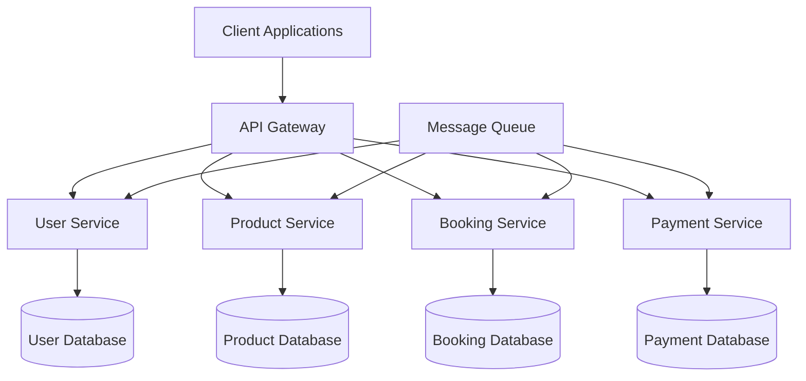

# TravelDen Documentation

Welcome to the comprehensive documentation for TravelDen, a modern travel booking platform built with microservices architecture.

## Overview

TravelDen is a scalable travel booking system that consists of multiple microservices working together to provide a seamless travel booking experience. This documentation covers the architecture, API endpoints, deployment procedures, and development guidelines.

## Architecture



## Services

Our platform consists of four main microservices:

- **[User Service](services/user-service.md)** - Handles user authentication, profiles, and authorization
- **[Product Service](services/product-service.md)** - Manages travel products, inventory, and search functionality
- **[Booking Service](services/booking-service.md)** - Processes bookings, reservations, and booking lifecycle
- **[Payment Service](services/payment-service.md)** - Handles payments, invoicing, and financial transactions

## Quick Start

### Using Docker

1. Clone the repository
2. Navigate to the `project-docs` directory
3. Run the documentation server:

```bash
docker-compose up mkdocs
```

4. Open your browser to `http://localhost:8000`

### Local Development

```bash
pip install mkdocs mkdocs-material mkdocs-mermaid2-plugin
mkdocs serve
```

## Features

- 📚 **Comprehensive API Documentation** - Complete REST API reference
- 🏗️ **Architecture Diagrams** - Visual system design with Mermaid
- 🐳 **Docker Support** - Containerized documentation setup
- 🚀 **CI/CD Integration** - Automated deployment to GitHub Pages
- 🔍 **Search Functionality** - Full-text search across all documentation
- 📱 **Responsive Design** - Mobile-friendly documentation

## Contributing

We welcome contributions to improve our documentation. Please see our [Development Guide](contributing/development.md) for more information.

## Support

For questions or support, please:

- Check our [API Documentation](api/getting-started.md)
- Review the [Deployment Guide](deployment/docker.md)
- Open an issue on GitHub

---

*Last updated: {{ git_revision_date_localized }}*