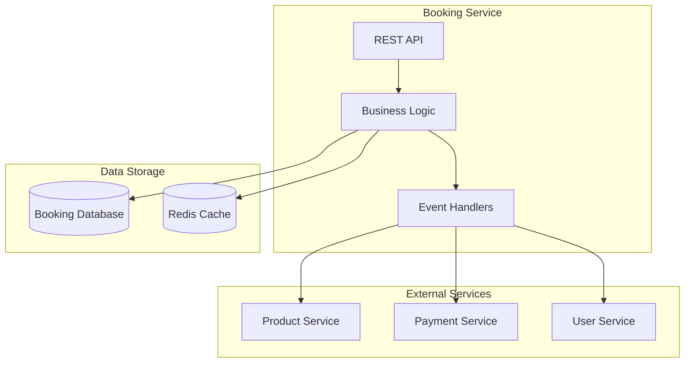
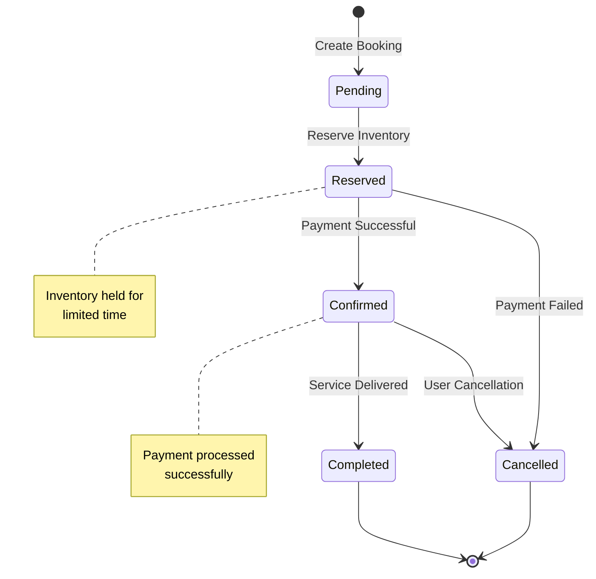
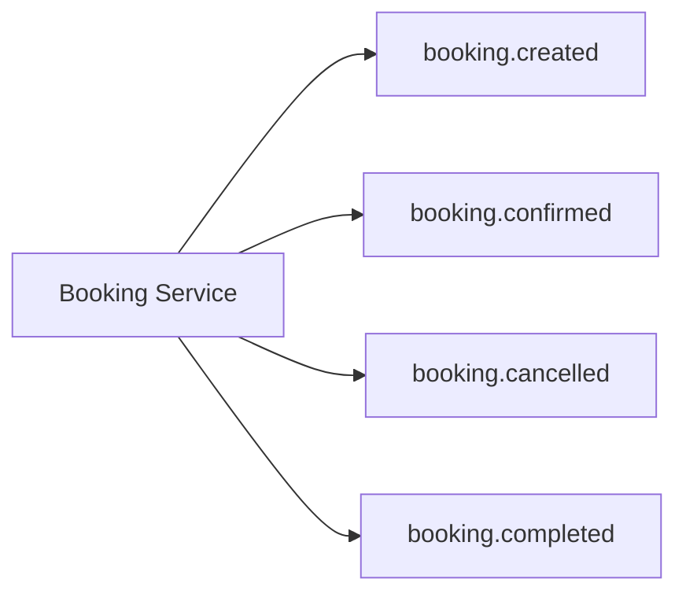
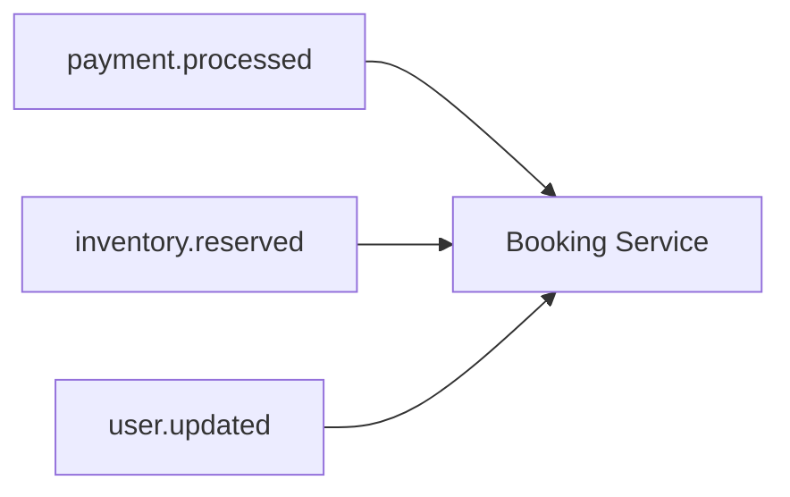
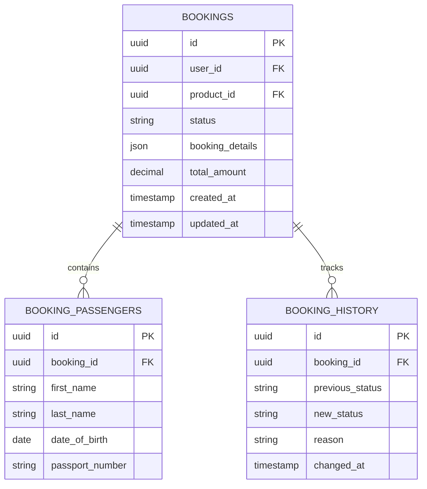

# Booking Service

The Booking Service is responsible for managing the entire booking lifecycle, from reservation creation to completion and cancellation.

## Overview



## Key Features

- **Booking Management**: Create, update, and cancel bookings
- **Reservation System**: Hold inventory while payment is processed
- **Status Tracking**: Track booking status throughout lifecycle
- **Event Integration**: Publish and consume booking-related events
- **Validation**: Ensure booking data integrity and business rules

## Booking Lifecycle



## API Endpoints

### Create Booking
```http
POST /api/bookings
Content-Type: application/json
Authorization: Bearer {token}

{
  "product_id": "uuid",
  "user_id": "uuid",
  "booking_details": {
    "passengers": [...],
    "travel_dates": {...},
    "preferences": {...}
  }
}
```

### Get Booking
```http
GET /api/bookings/{booking_id}
Authorization: Bearer {token}
```

### Update Booking
```http
PUT /api/bookings/{booking_id}
Content-Type: application/json
Authorization: Bearer {token}

{
  "status": "confirmed",
  "updated_details": {...}
}
```

### Cancel Booking
```http
DELETE /api/bookings/{booking_id}
Authorization: Bearer {token}
```

## Event Handling

### Published Events



### Consumed Events



## Database Schema



## Configuration

### Environment Variables

| Variable | Description | Default |
|----------|-------------|---------|
| `DB_HOST` | Database host | `localhost` |
| `DB_PORT` | Database port | `3306` |
| `DB_DATABASE` | Database name | `booking_service` |
| `REDIS_HOST` | Redis host | `localhost` |
| `REDIS_PORT` | Redis port | `6379` |
| `QUEUE_CONNECTION` | Queue driver | `redis` |

### Docker Configuration

```yaml
# docker-compose.yml excerpt
booking-service:
  build: ./travels-booking-service
  ports:
    - "8001:80"
  environment:
    - DB_HOST=booking-db
    - REDIS_HOST=redis
  depends_on:
    - booking-db
    - redis
```

## Testing

### Unit Tests
```bash
# Run unit tests
php artisan test --testsuite=Unit

# Run with coverage
php artisan test --coverage
```

### Integration Tests
```bash
# Run integration tests
php artisan test --testsuite=Feature

# Test specific booking flows
php artisan test tests/Feature/BookingFlowTest.php
```

## Monitoring

### Health Check
```http
GET /health
```

Response:
```json
{
  "status": "healthy",
  "database": "connected",
  "redis": "connected",
  "queue": "processing"
}
```

### Metrics
- Booking creation rate
- Booking confirmation rate
- Average booking processing time
- Error rates by endpoint

## Troubleshooting

### Common Issues

1. **Booking Creation Fails**
   - Check product availability
   - Verify user authentication
   - Validate booking details format

2. **Payment Integration Issues**
   - Verify payment service connectivity
   - Check event queue processing
   - Review payment webhook configuration

3. **Database Connection Issues**
   - Verify database credentials
   - Check network connectivity
   - Review connection pool settings

## Related Documentation

- [API Documentation](../api/endpoints.md)
- [Payment Service](payment-service.md)
- [Product Service](product-service.md)
- [Deployment Guide](../deployment/docker.md)